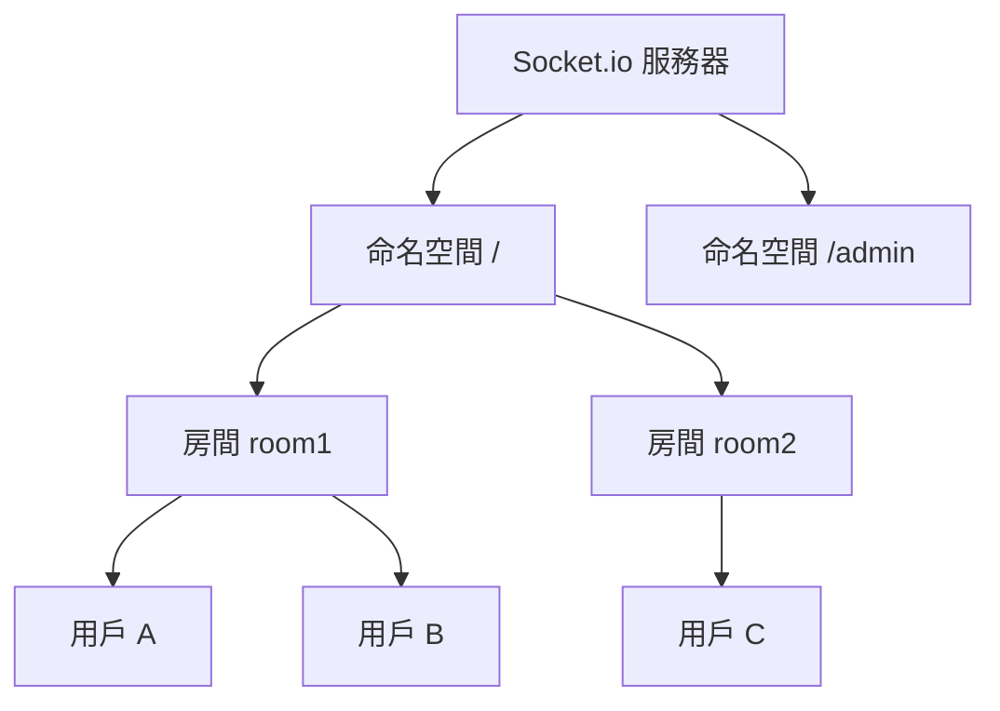

# 12.4.2 建立即時連接——Socket.io 基礎：服務端與客戶端配置

### 一句話破題

Socket.io 是 WebSocket 的"超級版"——它不僅封裝了 WebSocket，還自動處理降級、重連和跨平臺兼容性。

### 爲什麼選擇 Socket.io

原生 WebSocket 很底層，Socket.io 提供了：

- **自動降級**：不支持 WebSocket 時自動使用 HTTP 長輪詢
- **自動重連**：斷線後自動嘗試重新連接
- **房間和命名空間**：輕鬆管理用戶分組
- **事件機制**：基於事件名而非原始消息
- **跨平臺**：瀏覽器、Node.js、Python、Java 都有客戶端

### 快速上手

#### 安裝依賴

```bash
pnpm add socket.io socket.io-client
```

#### 服務端配置

```typescript
// server.ts
import { createServer } from 'http';
import { Server } from 'socket.io';

const httpServer = createServer();
const io = new Server(httpServer, {
  cors: {
    origin: 'http://localhost:3000',
    methods: ['GET', 'POST'],
  },
});

io.on('connection', (socket) => {
  console.log('用戶連接:', socket.id);

  // 監聽自定義事件
  socket.on('message', (data) => {
    console.log('收到消息:', data);
    // 廣播給所有人（除了發送者）
    socket.broadcast.emit('message', data);
  });

  // 斷開連接
  socket.on('disconnect', () => {
    console.log('用戶斷開:', socket.id);
  });
});

httpServer.listen(3001, () => {
  console.log('Socket.io 服務運行在 http://localhost:3001');
});
```

#### 客戶端配置

```tsx
// React 組件
'use client';

import { useEffect, useState } from 'react';
import { io, Socket } from 'socket.io-client';

export default function Chat() {
  const [socket, setSocket] = useState<Socket | null>(null);
  const [messages, setMessages] = useState<string[]>([]);
  const [input, setInput] = useState('');

  useEffect(() => {
    const newSocket = io('http://localhost:3001');
    setSocket(newSocket);

    newSocket.on('message', (data: string) => {
      setMessages((prev) => [...prev, data]);
    });

    return () => {
      newSocket.close();
    };
  }, []);

  const sendMessage = () => {
    if (socket && input.trim()) {
      socket.emit('message', input);
      setMessages((prev) => [...prev, `我: ${input}`]);
      setInput('');
    }
  };

  return (
    <div>
      <div>
        {messages.map((msg, i) => (
          <div key={i}>{msg}</div>
        ))}
      </div>
      <input
        value={input}
        onChange={(e) => setInput(e.target.value)}
        onKeyPress={(e) => e.key === 'Enter' && sendMessage()}
      />
      <button onClick={sendMessage}>發送</button>
    </div>
  );
}
```

### 在 Next.js 中集成

Next.js 使用自定義服務器來支持 Socket.io：

```typescript
// server.ts
import { createServer } from 'http';
import { parse } from 'url';
import next from 'next';
import { Server } from 'socket.io';

const dev = process.env.NODE_ENV !== 'production';
const app = next({ dev });
const handle = app.getRequestHandler();

app.prepare().then(() => {
  const server = createServer((req, res) => {
    const parsedUrl = parse(req.url!, true);
    handle(req, res, parsedUrl);
  });

  const io = new Server(server);

  io.on('connection', (socket) => {
    console.log('連接成功');
    // ... 事件處理
  });

  server.listen(3000, () => {
    console.log('> Ready on http://localhost:3000');
  });
});
```

### Socket.io 核心概念



- **命名空間 (Namespace)**：隔離不同功能的連接
- **房間 (Room)**：同一命名空間內的用戶分組
- **Socket**：單個用戶的連接實例

### AI 協作指南

- **核心意圖**：讓 AI 幫你搭建 Socket.io 服務。
- **需求定義公式**：`"請幫我在 Next.js 項目中集成 Socket.io，實現一個簡單的即時消息功能。"`
- **關鍵術語**：`emit`、`on`、`broadcast`、`room`、`namespace`

### 避坑指南

- **CORS 配置**：跨域時需要正確配置 CORS，否則連接會失敗。
- **客戶端複用**：不要在每次渲染時創建新的 socket 連接。
- **清理連接**：組件卸載時記得關閉 socket 連接。
