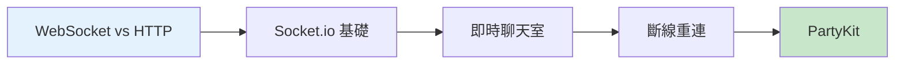

# 12.4 超越 HTTP 的即時世界——WebSockets 即時通信：在線聊天與協作功能

### 一句話破題

WebSocket 是讓服務器能"主動"給客戶端推送消息的技術，是構建聊天、協作、遊戲等即時應用的基石。

### 核心價值

傳統 HTTP 是"請求-響應"模式：客戶端問，服務器才答。但很多場景需要服務器主動通知客戶端：

- **即時通訊**：微信、Slack 的消息推送
- **協作編輯**：Google Docs、Figma 的多人同步
- **即時數據**：股票行情、體育比分
- **在線遊戲**：玩家動作同步

WebSocket 建立後，雙方可以隨時發送消息，實現真正的"雙向通信"。

### 本章導覽

1. **WebSocket vs HTTP**：理解爲什麼需要 WebSocket
2. **Socket.io 基礎**：快速搭建 WebSocket 服務
3. **即時聊天室**：構建房間和消息廣播功能
4. **斷線重連**：處理網絡不穩定的情況
5. **PartyKit**：現代化的邊緣即時通信方案

### 爲什麼 Vibe Coder 要學這個？

即時功能正在成爲用戶體驗的"基礎設施"：

- 用戶期望看到"即時"的反饋，而不是刷新頁面
- AI 應用的流式輸出本質上也是即時通信
- 協作功能是 SaaS 產品的差異化競爭力

> **關鍵洞察**：WebSocket 不難學，難的是處理好各種邊緣情況（斷線、重連、狀態同步）。Socket.io 和 PartyKit 幫你封裝了大量複雜性。
