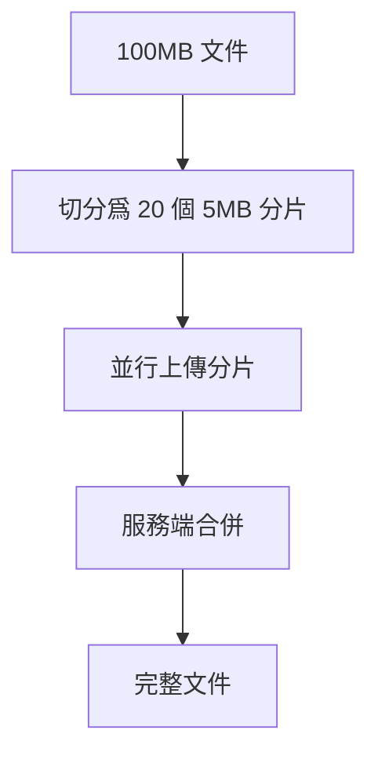

# 12.5.1 文件拆開傳——分片上傳原理：大文件切分與並行傳輸

### 一句話破題

分片上傳就是把大文件切成固定大小的小塊，分別上傳後在服務端拼接——這樣即使某塊失敗也只需重傳那一塊。

### 本質還原



### 前端分片實現

```typescript
const CHUNK_SIZE = 5 * 1024 * 1024; // 5MB

interface Chunk {
  index: number;
  blob: Blob;
  start: number;
  end: number;
}

function createChunks(file: File): Chunk[] {
  const chunks: Chunk[] = [];
  let start = 0;
  let index = 0;

  while (start < file.size) {
    const end = Math.min(start + CHUNK_SIZE, file.size);
    chunks.push({
      index,
      blob: file.slice(start, end),
      start,
      end,
    });
    start = end;
    index++;
  }

  return chunks;
}

// 使用示例
const file = document.getElementById('file').files[0];
const chunks = createChunks(file);
console.log(`文件大小: ${file.size}, 分片數: ${chunks.length}`);
```

### 並行上傳

```typescript
async function uploadChunk(
  chunk: Chunk,
  fileId: string,
  onProgress?: (percent: number) => void
): Promise<void> {
  const formData = new FormData();
  formData.append('chunk', chunk.blob);
  formData.append('index', chunk.index.toString());
  formData.append('fileId', fileId);

  await fetch('/api/upload/chunk', {
    method: 'POST',
    body: formData,
  });
}

async function uploadFile(file: File) {
  // 1. 初始化上傳，獲取 fileId
  const { fileId } = await fetch('/api/upload/init', {
    method: 'POST',
    body: JSON.stringify({ fileName: file.name, fileSize: file.size }),
    headers: { 'Content-Type': 'application/json' },
  }).then((r) => r.json());

  // 2. 創建分片
  const chunks = createChunks(file);

  // 3. 並行上傳（限制併發數）
  const concurrency = 3;
  for (let i = 0; i < chunks.length; i += concurrency) {
    const batch = chunks.slice(i, i + concurrency);
    await Promise.all(batch.map((chunk) => uploadChunk(chunk, fileId)));
    console.log(`已上傳 ${Math.min(i + concurrency, chunks.length)} / ${chunks.length}`);
  }

  // 4. 通知服務端合併
  await fetch('/api/upload/merge', {
    method: 'POST',
    body: JSON.stringify({ fileId, totalChunks: chunks.length }),
    headers: { 'Content-Type': 'application/json' },
  });
}
```

### 服務端處理

```typescript
// app/api/upload/chunk/route.ts
import { writeFile, mkdir } from 'fs/promises';
import { join } from 'path';

export async function POST(req: Request) {
  const formData = await req.formData();
  const chunk = formData.get('chunk') as File;
  const index = formData.get('index') as string;
  const fileId = formData.get('fileId') as string;

  const chunkDir = join(process.cwd(), 'uploads', fileId);
  await mkdir(chunkDir, { recursive: true });

  const buffer = Buffer.from(await chunk.arrayBuffer());
  await writeFile(join(chunkDir, index), buffer);

  return Response.json({ success: true });
}

// app/api/upload/merge/route.ts
import { readdir, readFile, writeFile, rm } from 'fs/promises';
import { join } from 'path';

export async function POST(req: Request) {
  const { fileId, totalChunks } = await req.json();
  const chunkDir = join(process.cwd(), 'uploads', fileId);

  // 按順序讀取併合並分片
  const chunks: Buffer[] = [];
  for (let i = 0; i < totalChunks; i++) {
    const chunkPath = join(chunkDir, i.toString());
    chunks.push(await readFile(chunkPath));
  }

  const mergedBuffer = Buffer.concat(chunks);
  await writeFile(join(process.cwd(), 'uploads', `${fileId}.file`), mergedBuffer);

  // 清理臨時分片
  await rm(chunkDir, { recursive: true });

  return Response.json({ success: true });
}
```

### AI 協作指南

- **核心意圖**：讓 AI 幫你實現分片上傳功能。
- **需求定義公式**：`"請幫我實現一個支持大文件分片上傳的組件，包括前端分片邏輯和後端接收合併，使用 Next.js App Router。"`
- **關鍵術語**：`分片 (chunk)`、`並行上傳`、`合併 (merge)`、`Blob.slice()`

### 避坑指南

- **分片大小選擇**：太小會增加請求數，太大可能超時。通常 1-10MB。
- **併發控制**：不要一次性上傳所有分片，會導致瀏覽器卡頓。
- **臨時文件清理**：記得清理上傳失敗或超時的臨時分片。
