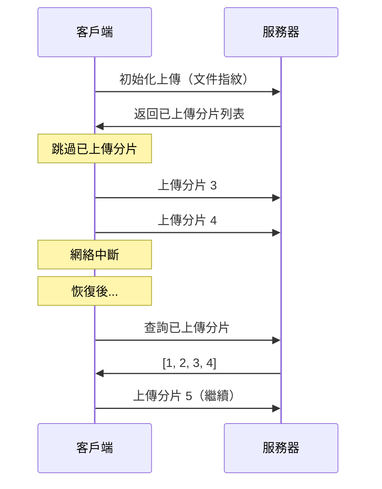

# 12.5.2 網斷了接着傳——斷點續傳：上傳進度保存與恢復

### 一句話破題

斷點續傳的核心是"記住已傳的"——客戶端記錄已上傳的分片，服務端記錄已接收的分片，重新上傳時跳過已完成的部分。

### 本質還原



### 文件指紋生成

用文件內容生成唯一標識，相同文件會得到相同指紋：

```typescript
async function getFileFingerprint(file: File): Promise<string> {
  // 取文件頭尾各 2MB + 中間 2MB 計算 hash
  const sliceSize = 2 * 1024 * 1024;
  const chunks = [
    file.slice(0, sliceSize),
    file.slice(Math.floor(file.size / 2) - sliceSize / 2, Math.floor(file.size / 2) + sliceSize / 2),
    file.slice(-sliceSize),
  ];

  const data = await Promise.all(chunks.map((c) => c.arrayBuffer()));
  const combined = new Uint8Array(data.reduce((acc, d) => acc + d.byteLength, 0));
  let offset = 0;
  data.forEach((d) => {
    combined.set(new Uint8Array(d), offset);
    offset += d.byteLength;
  });

  const hashBuffer = await crypto.subtle.digest('SHA-256', combined);
  const hashArray = Array.from(new Uint8Array(hashBuffer));
  return hashArray.map((b) => b.toString(16).padStart(2, '0')).join('');
}
```

### 客戶端實現

```typescript
interface UploadState {
  fileId: string;
  uploadedChunks: number[];
  totalChunks: number;
}

class ResumableUploader {
  private storageKey(fingerprint: string) {
    return `upload_${fingerprint}`;
  }

  private saveState(fingerprint: string, state: UploadState) {
    localStorage.setItem(this.storageKey(fingerprint), JSON.stringify(state));
  }

  private loadState(fingerprint: string): UploadState | null {
    const data = localStorage.getItem(this.storageKey(fingerprint));
    return data ? JSON.parse(data) : null;
  }

  async upload(file: File, onProgress: (percent: number) => void) {
    const fingerprint = await getFileFingerprint(file);
    let state = this.loadState(fingerprint);

    // 檢查服務端狀態
    if (state) {
      const serverState = await this.checkServerState(state.fileId);
      state.uploadedChunks = serverState.uploadedChunks;
    } else {
      // 新上傳
      const { fileId } = await this.initUpload(file, fingerprint);
      state = { fileId, uploadedChunks: [], totalChunks: 0 };
    }

    const chunks = createChunks(file);
    state.totalChunks = chunks.length;

    // 過濾已上傳的分片
    const pendingChunks = chunks.filter((c) => !state!.uploadedChunks.includes(c.index));

    for (const chunk of pendingChunks) {
      await this.uploadChunk(chunk, state.fileId);
      state.uploadedChunks.push(chunk.index);
      this.saveState(fingerprint, state);
      onProgress((state.uploadedChunks.length / chunks.length) * 100);
    }

    // 完成後清理本地狀態
    localStorage.removeItem(this.storageKey(fingerprint));
    await this.mergeChunks(state.fileId, chunks.length);
  }

  // ... 其他方法
}
```

### 秒傳實現

如果文件指紋已存在，直接返回已上傳的文件：

```typescript
// 服務端檢查
export async function POST(req: Request) {
  const { fingerprint, fileName, fileSize } = await req.json();

  // 檢查是否已存在相同文件
  const existingFile = await db.file.findUnique({
    where: { fingerprint },
  });

  if (existingFile) {
    return Response.json({
      status: 'exists',
      fileUrl: existingFile.url,
    });
  }

  // 創建新上傳任務
  const fileId = crypto.randomUUID();
  await db.uploadTask.create({
    data: { fileId, fingerprint, fileName, fileSize },
  });

  return Response.json({ status: 'new', fileId });
}
```

### AI 協作指南

- **核心意圖**：讓 AI 幫你實現斷點續傳功能。
- **需求定義公式**：`"請幫我實現一個支持斷點續傳和秒傳的文件上傳組件，使用文件指紋識別重複文件。"`
- **關鍵術語**：`斷點續傳 (resumable upload)`、`文件指紋 (fingerprint)`、`秒傳`、`SHA-256`

### 避坑指南

- **指紋計算性能**：不要對整個大文件計算 hash，取樣計算即可。
- **存儲清理**：定期清理過期的上傳任務和臨時文件。
- **併發控制**：同一文件不要允許多個客戶端同時上傳。
