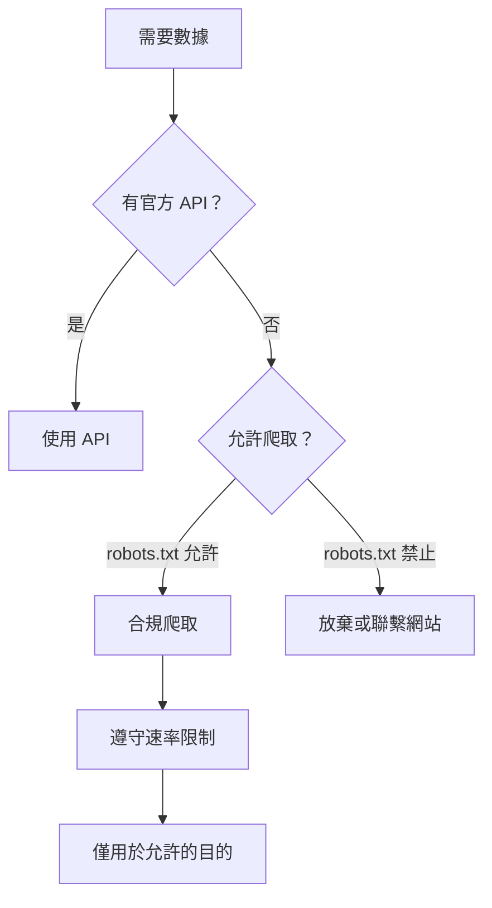

# 12.6.4 合法地獲取數據——合規爬蟲：API 優先與數據使用規範

### 一句話破題

合規爬蟲的第一原則是"API 優先"——如果有官方 API，永遠優先使用 API，只有在沒有 API 時才考慮爬取。

### API 優先策略



### 常見數據源的 API

| 平臺 | API | 限制 |
|------|-----|------|
| Twitter/X | Twitter API | 需要開發者賬號，有請求限額 |
| GitHub | GitHub API | 免費有速率限制 |
| Reddit | Reddit API | 需要註冊應用 |
| Wikipedia | MediaWiki API | 幾乎無限制，但要遵守禮儀 |
| 天氣數據 | OpenWeatherMap | 免費層有限額 |

### 數據使用的法律考量

| 數據類型 | 風險等級 | 注意事項 |
|----------|----------|----------|
| 公開統計數據 | 低 | 通常可以自由使用 |
| 用戶生成內容 | 中 | 可能涉及版權 |
| 個人信息 | 高 | 受隱私法保護（GDPR 等） |
| 商業數據 | 高 | 可能涉及商業祕密 |

### 合規爬蟲檢查清單

```typescript
interface ComplianceCheck {
  robotsTxtChecked: boolean;
  tosRead: boolean;
  apiAvailable: boolean;
  rateLimit: number;
  dataUsage: 'personal' | 'research' | 'commercial';
  personalDataCollected: boolean;
}

function assessCompliance(check: ComplianceCheck): string[] {
  const issues: string[] = [];
  
  if (!check.robotsTxtChecked) {
    issues.push('請先檢查 robots.txt');
  }
  
  if (!check.tosRead) {
    issues.push('請閱讀網站服務條款');
  }
  
  if (check.apiAvailable) {
    issues.push('建議使用官方 API 而非爬取');
  }
  
  if (check.rateLimit > 10) {
    issues.push('請求頻率可能過高');
  }
  
  if (check.dataUsage === 'commercial' && check.personalDataCollected) {
    issues.push('商業使用個人數據需要合規審查');
  }
  
  return issues;
}
```

### 數據存儲與使用

```typescript
interface ScrapedData {
  source: string;
  scrapedAt: Date;
  expiresAt: Date;
  license: string;
  personalData: boolean;
}

// 記錄數據來源和使用限制
function recordDataProvenance(data: unknown, source: string): ScrapedData {
  return {
    source,
    scrapedAt: new Date(),
    expiresAt: new Date(Date.now() + 30 * 24 * 60 * 60 * 1000), // 30 天后過期
    license: 'source-specific',
    personalData: false,
  };
}

// 定期清理過期數據
async function cleanExpiredData(db: Database) {
  await db.delete('scraped_data', {
    where: { expiresAt: { lt: new Date() } },
  });
}
```

### AI 協作指南

- **核心意圖**：讓 AI 幫你評估爬蟲的合規性。
- **需求定義公式**：`"請幫我評估爬取 [目標網站] 的合規性，包括 robots.txt 檢查、服務條款分析和數據使用建議。"`
- **關鍵術語**：`API`、`服務條款 (ToS)`、`GDPR`、`數據溯源 (data provenance)`

### 避坑指南

- **商業使用需謹慎**：商業用途的數據採集法律風險更高。
- **個人數據是雷區**：採集個人數據可能違反 GDPR 等隱私法規。
- **保留證據**：記錄你遵守規則的證據，以防日後爭議。
- **有疑問就詢問**：不確定時，聯繫網站所有者獲取許可。
