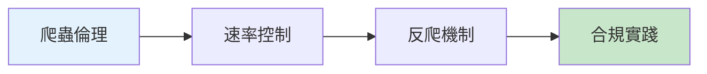

# 12.6 如何友好地爬取數據——爬蟲：速率/robots/反爬概要

### 一句話破題

網絡爬蟲是把雙刃劍——用得好是數據採集利器，用不好可能觸犯法律或被封禁。本章教你做一個"有禮貌"的爬蟲。

### 核心價值

爬蟲技術在以下場景很有價值：

- **數據分析**：採集公開數據進行市場分析
- **競品監控**：跟蹤競爭對手的產品信息
- **聚合服務**：整合多個來源的數據
- **AI 訓練**：收集訓練數據

但爬蟲也可能帶來問題：
- 給目標網站帶來壓力
- 違反服務條款
- 侵犯版權或隱私
- 觸犯法律法規

### 本章導覽

1. **爬蟲倫理**：理解 robots.txt 和網站條款
2. **速率控制**：控制請求頻率，不給目標網站添負擔
3. **反爬機制**：瞭解常見的反爬技術
4. **合規實踐**：優先使用 API，遵守數據使用規範

### 爲什麼 Vibe Coder 要學這個？

理解爬蟲技術能幫你：

- 高效獲取公開數據用於分析
- 理解如何保護自己的網站不被濫用
- 在法律和道德框架內工作

> **關鍵洞察**：優秀的開發者首先會尋找官方 API，只有在沒有 API 的情況下才考慮爬蟲，並且始終遵守 robots.txt 和服務條款。
