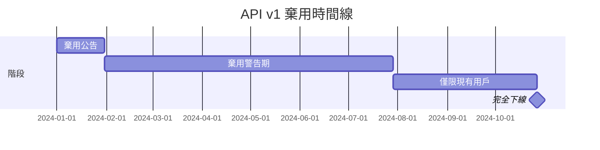

# 12.7.3 優雅地告別——功能下線的平滑過渡

### 一句話破題

功能下線的關鍵是"給用戶足夠的時間遷移"——通常是 6-12 個月的棄用期，加上持續的提醒和遷移支持。

### 棄用時間線



### 棄用警告響應頭

```typescript
// 中間件添加棄用警告
export function deprecationMiddleware(
  handler: (req: Request) => Promise<Response>,
  deprecationInfo: {
    sunset: Date;
    alternative: string;
  }
) {
  return async (req: Request) => {
    const response = await handler(req);
    
    // 添加標準棄用響應頭
    const headers = new Headers(response.headers);
    headers.set('Deprecation', 'true');
    headers.set('Sunset', deprecationInfo.sunset.toUTCString());
    headers.set('Link', `<${deprecationInfo.alternative}>; rel="successor-version"`);
    
    return new Response(response.body, {
      status: response.status,
      headers,
    });
  };
}

// 使用示例
export const GET = deprecationMiddleware(
  async () => Response.json({ users: [] }),
  {
    sunset: new Date('2024-12-31'),
    alternative: '/api/v2/users',
  }
);
```

### 棄用日誌和監控

```typescript
interface DeprecationUsage {
  endpoint: string;
  clientId?: string;
  timestamp: Date;
  userAgent: string;
}

async function logDeprecatedUsage(req: Request, endpoint: string) {
  const usage: DeprecationUsage = {
    endpoint,
    clientId: req.headers.get('X-Client-ID') || undefined,
    timestamp: new Date(),
    userAgent: req.headers.get('User-Agent') || 'unknown',
  };
  
  // 記錄到監控系統
  await analytics.track('deprecated_api_usage', usage);
  
  // 如果使用量仍然很高，可能需要延長棄用期
  const stats = await analytics.getStats(endpoint, { days: 7 });
  if (stats.requests > 10000) {
    await alertTeam(`${endpoint} 仍有大量使用，考慮延長棄用期`);
  }
}
```

### 漸進式功能降級

```typescript
interface FeatureStatus {
  enabled: boolean;
  deprecatedAt?: Date;
  sunsetAt?: Date;
  fallback?: string;
}

const features: Record<string, FeatureStatus> = {
  'legacy-search': {
    enabled: true,
    deprecatedAt: new Date('2024-01-01'),
    sunsetAt: new Date('2024-06-01'),
    fallback: 'new-search',
  },
};

function getFeatureStatus(feature: string): FeatureStatus {
  const status = features[feature];
  if (!status) return { enabled: false };
  
  const now = new Date();
  
  // 已過下線日期
  if (status.sunsetAt && now > status.sunsetAt) {
    return { enabled: false, fallback: status.fallback };
  }
  
  return status;
}

// 使用示例
async function search(query: string) {
  const status = getFeatureStatus('legacy-search');
  
  if (!status.enabled) {
    if (status.fallback) {
      return redirect(`/${status.fallback}?q=${query}`);
    }
    throw new Error('功能已下線');
  }
  
  // 執行舊版搜索
  return legacySearch(query);
}
```

### AI 協作指南

- **核心意圖**：讓 AI 幫你規劃功能下線路徑。
- **需求定義公式**：`"請幫我設計 API v1 的棄用計劃，包括時間線、警告機制和遷移指南。"`
- **關鍵術語**：`棄用 (deprecation)`、`日落 (sunset)`、`遷移 (migration)`、`兼容期`

### 避坑指南

- **棄用期要足夠長**：至少 6 個月，重要 API 可能需要 12 個月以上。
- **監控使用情況**：不要在使用量還很高時強制下線。
- **提供遷移工具**：如果可能，提供自動遷移腳本或工具。
