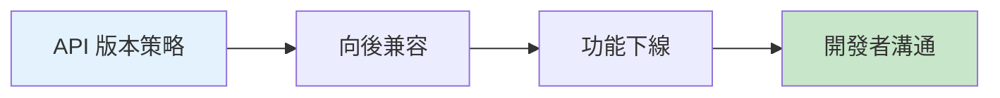

# 12.7 功能下線的藝術——版本化與變更日誌：兼容期與棄用路線圖

### 一句話破題

功能下線比上線更難——既要推動用戶遷移，又不能搞砸他們正在運行的應用。這需要周密的計劃和清晰的溝通。

### 核心價值

爲什麼要學會"優雅地下線"？

- **技術債務**：舊 API 維護成本越來越高
- **安全隱患**：老版本可能存在安全漏洞
- **用戶體驗**：舊功能可能阻礙產品發展
- **開發效率**：團隊需要集中精力在新功能上

但粗暴下線會：
- 破壞用戶的應用
- 損害品牌信任
- 引發客戶投訴

### 本章導覽

1. **API 版本策略**：如何設計可演進的 API
2. **向後兼容**：避免破壞性變更
3. **功能下線**：平滑過渡的方法
4. **開發者溝通**：如何告知用戶變更

### 爲什麼 Vibe Coder 要學這個？

無論你是 API 的提供者還是使用者：

- **作爲提供者**：你需要知道如何安全地演進 API
- **作爲使用者**：你需要理解棄用警告並及時遷移

> **關鍵洞察**：最好的棄用是用戶感知不到的——新版本如此優秀，用戶自願遷移。
