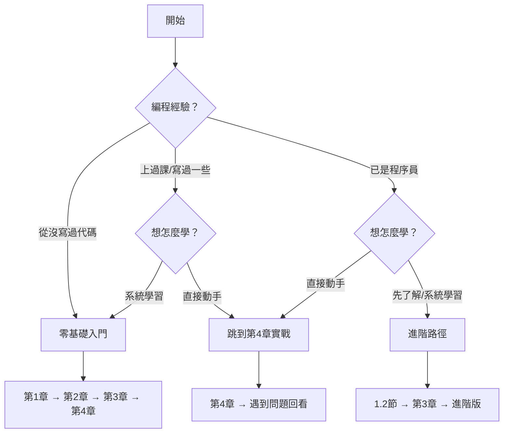

# 找到你的位置

## 這份教程寫給誰

  

    
零基礎

    
從沒接觸過編程，看到代碼就頭疼？時代變了。AI 幫你處理複雜部分，你只需把想要的東西說清楚。就像告訴裝修師傅"我想要亮堂的客廳"，你不需要自己砌牆接電線。

  

  

    
文科生/商科生

    
你可能覺得"編程是理科生的事"。但 Vibe Coding 的核心是表達、是把想法說清楚——這恰恰是你的強項。在 AI 編程時代，文科生的優勢比想象中大得多。

  

  

    
理工科學生

    
已經會寫代碼，爲什麼還要學？因爲你正在從"代碼生產者"變成"代碼指揮官"。核心技能正在遷移：從"寫得出來"到"說得清楚 + 判斷對錯"。

  

  

    
職場人士

    
想要個小工具，但技術部門排期三個月後？現在你可以自己動手——快速做原型驗證想法，用自然語言做數據分析，寫自動化腳本告別重複勞動。

  

  

    
創業者

    
最怕花三個月開發，結果沒人用。Vibe Coding 能幫你幾小時內做出能跑的原型，快速測試市場反應，低成本試錯。

  

## 學完獲得

  

    
一個親手做出的作品

    
能運行的網頁或小工具，可以分享給別人看

  

  

    
與 AI 協作的基本功

    
表達想法、拆解任務、引導 AI 修復錯誤

  

  

    
產品思維啓蒙

    
MVP 概念、功能取捨、寫 AI 能讀懂的需求

  

  

    
繼續探索的信心

    
具備獨立完成下一個項目的能力

  

## 學習路徑

本教程是整個體系的基礎版：

完成後可進入進階版，學習專業技術棧和完整產品開發流程。

## 從哪開始

| 背景 | 建議路徑 | 預計時長 |
|------|----------|----------|
| 零基礎 | 1→2→3→4 章順序讀 | 4-8 小時 |
| 文科/商科 | 重點 3、4 章 | 3-5 小時 |
| 理工科 | 1.2 節 → 3 章 → 進階版 | 2-4 小時 |
| 職場人士 | 2 章 → 4 章 | 3-4 小時 |

不確定？從第 1 章開始，覺得太基礎就往後跳。

---

[進入第 1 章：覺醒 →](/Basic/01-awakening/)
