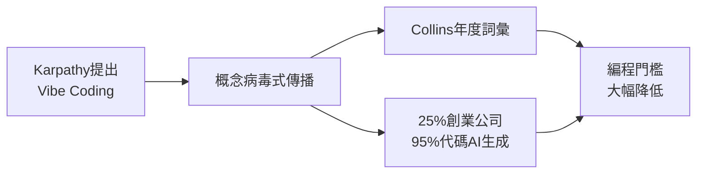

# 1.1.1 2025 年，編程世界發生了什麼

## 一條推文引發的革命

2025年2月，前特斯拉AI總監、OpenAI聯合創始人 Andrej Karpathy 在社交媒體上發了一條推文。

他說：

> "有一種新的編程方式，我稱之爲 'vibe coding'（氛圍編程）。你完全沉浸在感覺中，擁抱指數級變化，甚至忘記代碼的存在。"

這條推文引發廣泛討論的原因是——**我們正在進入一個不需要"寫"代碼也能"做"軟件的時代**。

## "Vibe Coding" 成爲年度熱詞

2025年11月，柯林斯詞典宣佈：**"Vibe Coding"** 當選年度詞彙。

這個詞的官方定義是：

> 一種使用人工智能、通過自然語言描述來生成計算機代碼的方式。

換句話說，你不需要學什麼編程語言，只要用自然語言告訴AI"我想要一個XX"，它就能幫你做出來。

## 數據不會說謊

以下是相關數據：

::: info Y Combinator 的驚人發現
2025年3月，全球最著名的創業孵化器 Y Combinator 的CEO Garry Tan 透露：

**在最新一批創業公司中，有25%的公司報告——它們95%的代碼是由AI生成的。**

這些不是玩票的業餘項目，而是正在融資、正在增長的真實創業公司。
:::

更讓人驚訝的是，這些公司的團隊規模往往不到10人，卻能做出以前需要幾十人才能完成的產品。

## 更多數據佐證

更多行業數據：

| 指標 | 數據 |
|------|------|
| 使用AI編程工具的美國開發者 | 92% |
| 全球代碼中AI生成的比例 | 41% |
| Vibe Coding用戶中非開發者佔比 | 63% |
| 使用AI後開發速度提升 | 最高55% |
| 市場規模預測（2032年） | 從49億→301億美元 |

*數據來源：Second Talent 2025統計、Bubble調研報告*

注意那個 **63%**——超過一半的Vibe Coding用戶根本不是程序員。他們是設計師、產品經理、創業者、甚至文科生。

## 這意味着什麼？

讓我們把這幾件事串起來：

**編程正在從"專業技能"變成"通用工具"。**

::: tip 核心洞察
就像 Excel 讓每個人都能處理數據，Word 讓每個人都能排版文檔一樣，AI 編程工具正在讓每個人都能創造軟件。
:::

## 小結

2025年是Vibe Coding元年。Karpathy提出概念，Collins詞典收錄爲年度詞彙，Y Combinator數據驗證了這一趨勢的實際影響。接下來，我們看看這場變革如何改變開發者的角色。
