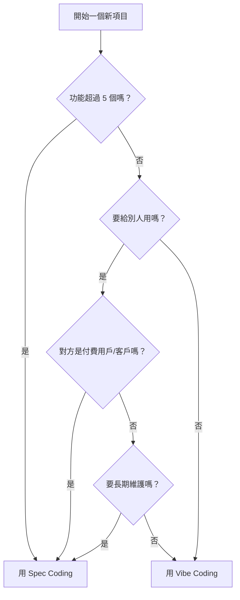

# 1.2.3 Vibe vs Spec：什麼時候用什麼

學完了 Vibe Coding 和 Spec Coding，下一個問題是：項目到底該用哪個？

這一節提供一個簡單的決策框架。

## 三個問題快速判斷

在開始一個項目前，問自己三個問題：

| 問題 | 需要 Spec 的信號 |
|------|-----------------|
| **功能數量** | 超過 5 個功能 |
| **使用者** | 給客戶/團隊用 |
| **時長** | 需要長期維護 |

**判斷規則**：如果有 2 個以上回答"需要 Spec"，就用 Spec Coding；否則 Vibe Coding 即可。

## 決策流程圖

**簡單記：小項目、自己用、短期使用 → Vibe；大項目、給別人、長期維護 → Spec。**

## 混合使用：最佳實踐

實際工作中，你不需要非此即彼。很多時候，混合使用效果最好。

### 模式 1：Vibe 起步，Spec 收尾

**適合場景**：你有個想法，不確定能不能做出來。

**流程**：
1. 先用 Vibe Coding 快速做個最小原型
2. 驗證想法可行後，暫停寫代碼
3. 補上需求文檔和任務清單
4. 後續開發用 Spec Coding 方式

**好處**：不會在一個不靠譜的想法上浪費時間寫文檔。

### 模式 2：Spec 規劃，Vibe 執行

**適合場景**：你很清楚要做什麼，只是需要 AI 幫你快速實現。

**流程**：
1. 先花 10 分鐘寫個簡單的需求清單
2. 把清單分成小任務
3. 每個小任務用 Vibe Coding 快速完成
4. 完成後檢查是否符合需求

**好處**：既有方向感，執行又快。

### 模式 3：漸進式演進

**適合場景**：項目會逐漸變大，一開始不知道會發展成什麼樣。

**流程**：
1. 第一版：純 Vibe，快速上線
2. 開始有用戶反饋，功能變多：補上簡單文檔
3. 用戶越來越多，需要穩定：正式用 Spec 方式管理

**好處**：按需投入，不過度設計。

## 實際案例

### 案例 1：做一個番茄鍾小工具

**分析**：
- 功能：倒計時 + 開始/暫停 + 提醒 = 3 個功能
- 使用者：自己
- 時長：用幾周就可能換別的

**決定**：Vibe Coding

**Prompt 示例**：
> "幫我做一個番茄鍾網頁，25 分鐘倒計時，有開始、暫停、重置按鈕，時間到了彈窗提醒。"

### 案例 2：做一個團隊內部的日報系統

**分析**：
- 功能：寫日報 + 查看歷史 + 按人篩選 + 按日期篩選 + 導出 + 統計 = 6 個功能
- 使用者：團隊 10 個人
- 時長：長期使用

**決定**：Spec Coding

**第一步**：先寫需求文檔
> "幫我寫一份'團隊日報系統'的需求文檔，包括產品概述、目標用戶、核心功能（寫日報、查看歷史、按人篩選、按日期篩選、導出、統計）和不做什麼。"

### 案例 3：驗證一個創業想法

**分析**：
- 想法：一個幫人匹配學習夥伴的平臺
- 不確定能不能做出來
- 不確定有沒有人用

**決定**：先 Vibe，再看情況

**流程**：
1. 用 Vibe Coding 做一個最簡單的版本（只有填表單 + 看匹配結果）
2. 發給 10 個朋友試用
3. 如果反饋好，再補文檔、做完整版

## 記住一句話

> **先開始，再完善。**

不要在"用 Vibe 還是 Spec"上糾結太久。如果糾結，就先 Vibe 起來；做着做着發現亂了，再停下來補文檔。這本身就是一種學習過程。沒有人第一次就選對，重要的是**開始**。

## 快速檢查清單

開始項目前，花 30 秒過一遍：功能超過 5 個嗎？要給別人用嗎？要長期維護嗎？

**如果有 2 個以上回答"是"，建議用 Spec Coding；否則 Vibe Coding 即可。**

::: info 小結
- 小項目、自己用、短期使用 → Vibe Coding
- 大項目、給別人、長期用 → Spec Coding
- 可以混合使用：Vibe 起步 + Spec 收尾 是常見模式
- 不要糾結，先開始，做着再調整
:::

下一節，我們來學習一些 AI 編程中必須知道的[核心概念](./1.2.4-other-concepts.md)：Prompt、Context、Token 等。
