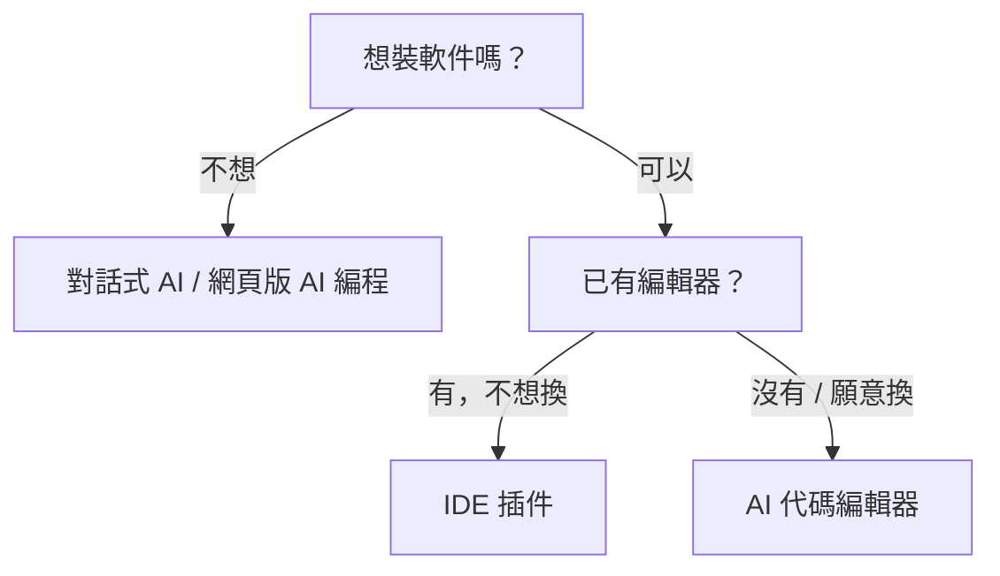

# 1.4.3 按你的情況選擇

工具那麼多，到底選哪個？

別焦慮。這一節幫你快速定位——根據你現在的情況，給你最直接的建議。

## 快速定位：你是哪種情況？

### 情況 A：完全零基礎，想先體驗一下

**你的狀態**：從沒寫過代碼，甚至有點怕技術。只是好奇想試試。

**推薦工具類別**：

| 類型 | 工具類別 |
|------|---------|
| 先聊天體驗 | 對話式 AI（如 Claude、豆包） |
| 直接看成品 | 網頁版 AI 編程 |

**兩種入門方式**：

1. **先聊天試試**：打開任意一個對話式 AI，輸入"幫我寫一個顯示當前時間的網頁"——AI 會給你代碼。

2. **直接看成品**：打開網頁版 AI 編程工具，輸入同樣的話，直接看到可運行的網頁。

**第一步行動**：參考 [1.4.1](./1.4.1-env-setup.md) 選一個工具，輸入「幫我做一個顯示當前時間的網頁」，1-2 分鐘後就能看到結果。

### 情況 B：想快速做出東西，驗證一個想法

**你的狀態**：有個小想法（比如做個小工具、簡單網站），想快速看到成果。

**推薦工具類別**：網頁版 AI 編程

從描述到上線，可能只要 10-30 分鐘。生成的項目可以直接分享鏈接給別人。

具體工具參考 [1.4.1 網頁版 AI 編程](./1.4.1-env-setup.md#網頁版-ai-編程零安裝的一站式方案)。

### 情況 C：用過 VS Code，想深入學習 AI 編程

**你的狀態**：有一點編程基礎（哪怕只是看過教程），想認真學習 AI 輔助開發。

**推薦工具類別**：AI 代碼編輯器

**爲什麼選這類工具**：
- 基於 VS Code，界面熟悉
- 能理解整個項目的上下文
- 具備 Agent 能力，能自動處理多文件任務

::: info 什麼是 Agent？
2025 年 AI 編程的核心能力：AI 不只補全代碼，還能自己規劃任務、讀取多個文件、執行命令——像有個助手幫你幹活，而不只是給建議。
:::

參考 [1.4.1 AI 代碼編輯器](./1.4.1-env-setup.md#ai-代碼編輯器獨立安裝的專業工具) 的對比表格，根據你的偏好選擇。

### 情況 D：只想做漂亮的界面

**你的狀態**：需要做一些好看的網頁組件、落地頁、UI 界面。

**推薦工具類別**：網頁版 AI 編程（UI 專長的如 v0.dev）

**適合場景**：
- 做產品落地頁
- 設計系統裏的組件
- 需要交付給開發的原型

### 情況 E：已是開發者，追求效率

**你的狀態**：已經會寫代碼，想讓 AI 幫你提效。

**推薦工具類別**：

| 場景 | 工具類別 |
|------|---------|
| 日常開發 | AI 代碼編輯器 |
| 快速原型 | 網頁版 AI 編程 |
| 終端效率 | 命令行工具 |

**組合建議**：多個類別搭配使用，各取所長。

### 情況 F：已有編輯器，只想加 AI 插件

**你的狀態**：習慣了 VS Code 或 JetBrains，不想換編輯器，只想加個 AI 助手。

**推薦工具類別**：IDE 插件

**適合場景**：
- 已經有成熟的開發環境
- 團隊統一使用某個 IDE
- 不想學新工具，只想加 AI 能力

具體工具參考 [1.4.1 IDE 插件](./1.4.1-env-setup.md#ide-插件擴展給現有編輯器加-ai)。

## 工具選擇決策樹

如果你還是不確定，跟着這個流程走：

## 常見選擇誤區

### 誤區 1：「要選最好的工具」

**真相**：沒有"最好"，只有"適合"。

工具只是手段。你用 Bolt.new 做出來的網站，和用 Cursor 做出來的，用戶根本看不出區別。

### 誤區 2：「免費的肯定不好用」

**真相**：2025 年的免費額度已經很慷慨了。

- Claude.ai 免費版足夠體驗
- Windsurf 免費版夠日常學習
- Bolt.new 免費額度能做好幾個小項目

先用免費的，真的不夠再付費。

### 誤區 3：「要把所有工具都學會」

**真相**：選一個，用熟了再換。

工具的核心能力是相通的（上一節講的五大能力）。用熟一個之後，換其他的只需要適應界面，不用重新學。

## 本節小結

| 你的情況 | 推薦類別 |
|---------|---------|
| 不想裝軟件 | 對話式 AI / 網頁版 AI 編程 |
| 想裝軟件 | AI 代碼編輯器 |
| 已有編輯器不想換 | IDE 插件 |
| 追求終端效率 | 命令行工具 |

具體工具請參考 [1.4.1 工具全景圖](./1.4.1-env-setup.md)。

> **最重要的建議**：別糾結太久。選一個類別，去 1.4.1 挑一個工具，現在就打開試試。

> 下一節，我們來聊聊本教程的"工具策略"——爲什麼我們不綁定特定工具，以及這對你意味着什麼。
