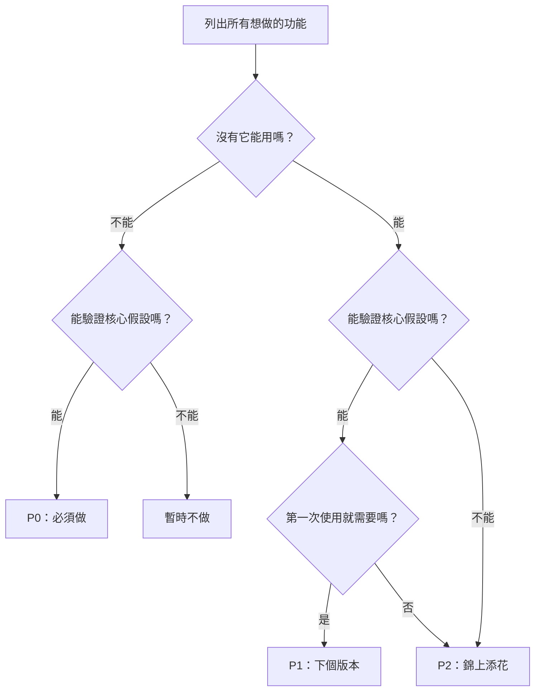

# 2.3.4 如何從 20 個功能砍到 3 個

理解了 MVP 的含義，下一個問題是：具體怎麼做減法？

本節提供一套可操作的方法。


## 砍功能的三個靈魂問題

面對每一個功能，問自己這三個問題：

### 問題 1：沒有這個功能，產品還能用嗎？

這個問題幫你區分「核心功能」和「附加功能」。

**判斷標準**：
- 如果答案是「能」→ 這個功能不是核心功能
- 如果答案是「不能」→ 這可能是核心功能

**待辦清單的例子**：
| 功能 | 沒有它能用嗎？ | 結論 |
|-----|--------------|------|
| 添加任務 | 不能 | 核心功能 |
| 完成任務 | 不能 | 核心功能 |
| 查看任務列表 | 不能 | 核心功能 |
| 任務分類 | 能（先不分類也行） | 非核心 |
| 暗黑模式 | 能（不影響使用） | 非核心 |
| 統計報表 | 能（知道完成了就行） | 非核心 |


### 問題 2：這個功能能驗證我的核心假設嗎？

這個問題幫你聚焦於驗證假設的功能。

**判斷標準**：
- 如果答案是「能」→ 考慮保留
- 如果答案是「不能」→ 暫時不做

**待辦清單的例子**：

假設核心假設是：「極簡待辦比便籤紙更容易堅持」

| 功能 | 能驗證假設嗎？ | 理由 |
|-----|--------------|------|
| 一鍵添加任務 | 能 | 測試「極簡」是否真的更容易用 |
| 打卡日曆 | 不確定 | 可能有用，但不是驗證「極簡」的關鍵 |
| 社交分享 | 不能 | 這是增長功能，不是驗證功能 |
| 成就係統 | 不能 | 這是留存功能，先驗證核心價值再說 |


### 問題 3：用戶第一次使用就需要這個功能嗎？

這個問題幫你區分「獲客功能」和「留存功能」。

**判斷標準**：
- 第一次使用就需要 → 可能是 P0
- 用了一段時間才需要 → 可能是 P1
- 錦上添花 → 可能是 P2

**關鍵洞見**：
- 新用戶只關心「這個東西能幫我做什麼」
- 排行榜、成就係統、社交功能是讓用戶「留下來」的，不是讓用戶「進來」的
- MVP 階段應該聚焦於讓用戶「進來並體驗覈心價值」


## P0/P1/P2 優先級框架

用三個問題篩選後，把功能分成三檔：

| 優先級 | 定義 | 行動 | 示例 |
|-------|------|------|------|
| **P0** | 沒有就無法驗證核心價值 | 必須在 MVP 中包含 | 添加任務、完成任務 |
| **P1** | 重要但可以後續迭代 | V2 版本再做 | 任務分類、提醒功能 |
| **P2** | 錦上添花 | 有時間再說 | 暗黑模式、統計報表 |

**原則**：
- P0 功能不超過 3-5 個
- 如果 P0 超過 5 個，說明你還沒想清楚核心價值是什麼
- P1 和 P2 寫下來但暫時不做，防止忘記也防止誘惑


## 砍功能決策樹

把上面的方法整理成一個決策流程：




## AI 輔助：讓 AI 幫你砍功能

你可以直接把功能列表交給 AI，讓它幫你做優先級分析。

### Prompt 模板

```markdown
我正在做一個項目：[項目描述]

目標用戶是：[用戶描述]

我的核心假設是：[假設描述]

我目前規劃了這些功能：
1. [功能1]
2. [功能2]
3. [功能3]
...

請幫我分析：
1. 哪些是 P0 核心功能（沒有就不能驗證假設）
2. 哪些是 P1 可以後續迭代的功能
3. 哪些是 P2 錦上添花可以先砍掉的功能

請給出分類理由。
```

### 示例：待辦清單項目

```markdown
我正在做一個項目：幫助職場人士管理每日待辦事項

目標用戶是：25-35歲職場人士，每天有5-10個待辦事項需要管理

我的核心假設是：人們不用複雜的待辦工具，是因爲太麻煩；
如果有一個極簡的工具，他們會更願意用

我目前規劃了這些功能：
1. 添加任務
2. 完成任務（打勾）
3. 查看今日任務
4. 任務分類
5. 優先級標籤
6. 截止日期提醒
7. 重複任務
8. 子任務拆解
9. 日曆視圖
10. 統計報表
11. 多設備同步
12. 暗黑模式

請幫我分析優先級。
```

### AI 可能的回覆

```
基於你的核心假設「極簡更容易堅持」，我的分析如下：

**P0（核心功能，必須有）**：
1. 添加任務 - 最基礎的功能
2. 完成任務 - 驗證「用起來」的閉環
3. 查看今日任務 - 知道今天要做什麼

理由：這三個功能構成最小閉環，可以驗證用戶是否願意用極簡工具

**P1（下個版本）**：
4. 截止日期提醒 - 有價值，但可以先手動記
5. 任務分類 - 任務多了才需要

**P2（暫時不做）**：
6-12 全部。理由：
- 優先級標籤、子任務：增加複雜度，與「極簡」假設矛盾
- 日曆視圖、統計報表：是「高級功能」，不是核心價值
- 多設備同步：需要後端，大大增加開發複雜度
- 暗黑模式：純粹美化，不影響核心驗證

建議 MVP 只做前 3 個功能。
```


## 實戰演練：爲待辦清單做減法

讓我們用這套方法，爲小李的項目做一次完整的減法：

### 原始功能清單（14 個）

1. 任務分類
2. 優先級標籤
3. 截止日期提醒
4. 重複任務
5. 子任務拆解
6. 標籤系統
7. 日曆視圖
8. 看板視圖
9. 統計報表
10. 多設備同步
11. 團隊協作
12. 評論功能
13. 暗黑模式
14. 桌面小組件

### 核心假設

> 職場人士願意用一個極簡工具管理待辦，因爲它比複雜工具更容易堅持。

### 應用三個問題

| 功能 | Q1：沒有能用？ | Q2：驗證假設？ | Q3：首次需要？ | 優先級 |
|-----|--------------|--------------|--------------|-------|
| 添加任務 | 不能 | 能 | 是 | **P0** |
| 完成任務 | 不能 | 能 | 是 | **P0** |
| 查看任務 | 不能 | 能 | 是 | **P0** |
| 任務分類 | 能 | 不確定 | 不一定 | P1 |
| 優先級標籤 | 能 | 否（增加複雜度） | 否 | P2 |
| 截止日期提醒 | 能 | 部分 | 不一定 | P1 |
| 重複任務 | 能 | 否 | 否 | P2 |
| 子任務拆解 | 能 | 否 | 否 | P2 |
| 標籤系統 | 能 | 否 | 否 | P2 |
| 日曆視圖 | 能 | 否 | 否 | P2 |
| 看板視圖 | 能 | 否 | 否 | P2 |
| 統計報表 | 能 | 否 | 否 | P2 |
| 多設備同步 | 能 | 否 | 否 | P2 |
| 團隊協作 | 能 | 否 | 否 | P2 |
| 評論功能 | 能 | 否 | 否 | P2 |
| 暗黑模式 | 能 | 否 | 否 | P2 |
| 桌面小組件 | 能 | 否 | 否 | P2 |

### 結論

**P0（MVP 必須有）**：3 個
- 添加任務
- 完成任務
- 查看今日任務

**P1（下個版本）**：2 個
- 任務分類
- 截止日期提醒

**P2（暫不做）**：12 個
- 其他全部

從 14 個功能砍到 3 個。這就是減法。


## 本節要點

你現在掌握了具體的砍功能方法：

- 三個靈魂問題幫你快速判斷功能優先級
- P0/P1/P2 框架幫你結構化思考
- AI 可以輔助你做優先級分析
- 核心原則：P0 不超過 3-5 個

接下來，我們學習另一個被低估的工具：「不做清單」。
