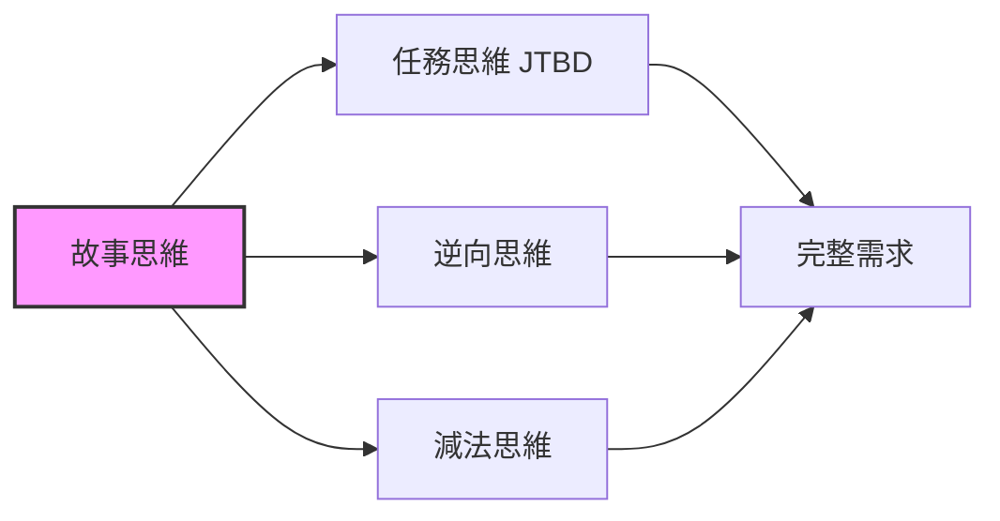

# 2.4 故事思維：把用戶當作故事的主角

在前面的章節中，我們學會了用「任務視角」思考需求，用「逆向思維」識別風險，用「減法思維」聚焦核心。

現在，我們要學習一個讓這些工具更有力量的方法：**把用戶當作故事的主角**。

## 經過本節學習，你將掌握

- 理解爲什麼「講故事」比「列功能」更有效
- 學會用「三維構建法」創建立體的用戶畫像
- 掌握「用戶旅程地圖」這個可視化工具
- 獲得可直接複製的「故事化 Prompt」模板

## 本節核心洞見

> "如果你想讓人們記住什麼，就把它變成一個故事。"
> —— Tim Brown，IDEO 設計公司 CEO

斯坦福大學的研究表明：當信息以故事形式呈現時，人們的記憶留存率是純數據的 22 倍。

這意味着什麼？

- 當你對 AI 說「做一個待辦清單」，AI 只能猜測你想要什麼
- 當你講述「我是一個每天處理 10 件事的職場人，總怕遺漏重要事項」，AI 能精準理解你的需求

**故事不是修辭技巧，而是最高效的溝通方式。**

## 故事思維與其他工具的關係

你可能會問：故事思維和前面學的工具有什麼區別？

簡單說：

| 思維工具 | 回答的核心問題 |
|---------|--------------|
| 任務思維 | 用戶要完成什麼任務？ |
| 逆向思維 | 什麼會導致失敗？ |
| 減法思維 | 什麼功能可以不做？ |
| **故事思維** | **用戶是誰？他經歷了什麼？** |

故事思維是其他工具的「底座」。當你真正理解用戶是誰、經歷了什麼，任務、風險、優先級都會變得更清晰。

## 這不只是「做產品」的事

和前面的章節一樣，故事思維適用於你想用 AI 做的任何事情：

| 你想做的事情 | 故事思維幫你解決的問題 |
|-------------|---------------------|
| 做一個小工具 | 讓你從「我想要什麼功能」轉向「我的用戶經歷了什麼」 |
| 數據分析報告 | 幫你理解「老闆看這份報告時在想什麼」 |
| 自動化腳本 | 讓你看清「這個重複勞動背後的完整場景」 |
| 給家人做工具 | 幫你站在「60 歲父母的視角」思考問題 |

無論你的目標是什麼，故事思維都能幫你更深入地理解「爲誰而做」。

## 本節結構

接下來，我們將通過以下內容，幫你掌握故事思維：

1. **產品即故事**：理解故事的基本結構，學會用故事視角描述需求
2. **三維用戶畫像**：超越「年齡職業」，構建有血有肉的用戶形象
3. **用戶旅程地圖**：把故事可視化，找到最重要的痛點
4. **故事化 Prompt**：用故事思維寫出更精準的 AI 指令
5. **實戰練習**：爲你自己的項目應用故事思維
6. **核心要點**：帶走可以立即應用的原則

準備好了嗎？讓我們從「什麼是好故事」開始。
