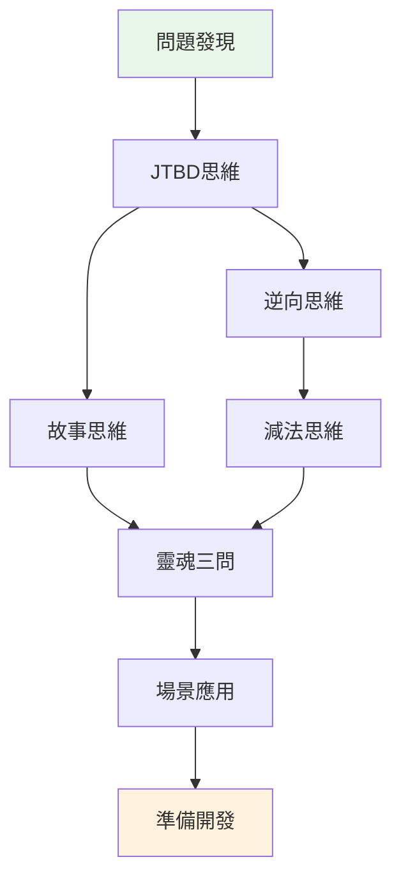

# 2.8 本章總結：產品經理的思維工具箱

經過本節學習，你將掌握：
- 七個思維模型之間的協同關係
- 從"有個想法"到"準備開發"的完整思考流程
- 一個可反覆使用的項目啓動決策框架

## 七大模型不是孤立的工具

在前面的章節中，你學習了七個思維模型。但它們不是七個獨立的工具，而是一個**完整的思考鏈條**。

| 階段 | 使用的模型 | 核心問題 |
|-----|-----------|---------|
| **發現階段** | 問題發現 | 什麼問題值得解決？ |
| **定義階段** | JTBD思維 | 用戶要完成什麼任務？ |
| **規避階段** | 逆向思維 | 什麼會導致失敗？ |
| **聚焦階段** | 減法思維 | 第一版只做什麼？ |
| **理解階段** | 故事思維 | 用戶經歷了什麼？ |
| **驗證階段** | 靈魂三問 | 我想清楚了嗎？ |
| **適配階段** | 場景應用 | 這個場景有什麼特殊要求？ |

## 思維模型的使用順序

### 第一步：從問題開始，不是從功能開始

很多人的起點是"我想做一個xxx"。但正確的起點是"我發現了一個問題"。

**問題發現**幫你識別值得解決的問題。**JTBD思維**幫你理解用戶真正要完成的任務，而不是你想象中的功能列表。

### 第二步：先想失敗，再想成功

有了清晰的任務定義後，不要急着規劃功能。

**逆向思維**讓你先列出"什麼會導致失敗"。這些失敗因素會指向一個共同的問題：想做的太多。

**減法思維**幫你砍掉不必要的功能，聚焦到能驗證核心假設的最小版本。

### 第三步：理解用戶，驗證想法

功能範圍確定後，你需要確認自己真的理解用戶。

**故事思維**讓你把用戶當作故事的主角，理解他們的處境和情緒。

**靈魂三問**是最後的自檢：用戶是誰？痛點在哪？爲什麼選你？

### 第四步：根據場景調整

不同場景有不同的側重點。

**場景應用**幫你把通用的思維模型適配到具體場景：數據分析、自動化腳本、個人工具、給家人做的工具。

## 貫穿案例：從"想做待辦清單"到"準備好開發"

讓我們用小李的待辦清單項目，完整演示如何串聯使用七個模型。

### Step 1：問題發現

小李是一名職場新人。他發現自己經常遺漏重要的事情，被領導批評了好幾次。

他用"煩惱日記"記錄了一週：

| 日期 | 煩惱瞬間 | 頻率 | 痛苦程度 |
|-----|---------|-----|---------|
| 週一 | 忘了給客戶回郵件 | 每週2-3次 | 8分 |
| 週三 | 會議時間記錯了 | 每月1-2次 | 6分 |
| 週五 | 週報忘了寫 | 每週1次 | 7分 |

用五維評分法評估"遺漏任務"這個問題：
- 重複性：5分（幾乎每天都有）
- 規則性：4分（可以用清單解決）
- 可驗證性：5分（自己用就能驗證）
- 敏感性：5分（不涉及隱私和資金）
- 容錯性：4分（錯了可以調整）

**總分：23分，適合用Vibe Coding解決。**

### Step 2：JTBD思維

小李問自己：我真正要完成的任務是什麼？

用JTBD模板描述：

> 當我每天開始工作時，我想快速記錄今天要做的事，這樣我就不會遺漏重要任務，可以安心投入工作。

任務的三個層次：
- **功能任務**：記錄和查看待辦事項
- **情感任務**：減少焦慮，感到安心
- **社會任務**：在領導和同事面前顯得靠譜

### Step 3：逆向思維

小李做了一個Pre-mortem分析：假設三個月後項目失敗了，可能是什麼原因？

| 失敗原因 | 可能性 | 嚴重性 | 預防措施 |
|---------|-------|-------|---------|
| 功能太多，做不完 | 高 | 高 | 第一版只做3個核心功能 |
| 用起來比便籤還麻煩 | 中 | 高 | 添加任務必須在3秒內完成 |
| 做完了自己都不用 | 中 | 高 | 先用一週紙質清單驗證習慣 |
| 需要打開電腦才能用 | 低 | 中 | 先做網頁版，手機也能訪問 |

### Step 4：減法思維

基於Pre-mortem的分析，小李明確了MVP範圍：

**核心假設**：一個極簡的每日待辦清單，比便籤紙和手機備忘錄更好用。

**驗證標準**：自己連續使用7天，每天都用它記錄和完成任務。

**P0功能**（必須有）：
1. 添加任務
2. 完成任務（打勾）
3. 查看今日任務

**不做清單**：
- 不做分類標籤
- 不做截止日期
- 不做提醒通知
- 不做歷史統計

### Step 5：故事思維

小李用三維畫像描述自己（作爲用戶）：

| 維度 | 內容 |
|-----|------|
| **表面屬性** | 25歲，職場新人，每天處理10-15件大小事務 |
| **行爲習慣** | 早上到公司第一件事是看郵件，用手機備忘錄記事但經常忘記看 |
| **深層動機** | 害怕遺漏任務被領導批評，想成爲一個靠譜的人 |

用戶旅程的關鍵觸點：
- 早上到公司，打開電腦
- 突然想起一件事，需要快速記下來
- 下班前，檢查今天的事情是否都完成了

### Step 6：靈魂三問

最後的自檢：

| 問題 | 回答 | 狀態 |
|-----|------|------|
| 用戶是誰？ | 我自己——一個怕遺漏任務的職場新人 | 🟢 清晰 |
| 痛點在哪？ | 經常忘事，被批評，感到焦慮 | 🟢 清晰 |
| 爲什麼選我？ | 現有工具要麼太複雜，要麼容易忘記看；我要做一個打開就是今日待辦的極簡工具 | 🟢 清晰 |

**三個綠燈，可以開始開發了。**

## 模型選擇速查表

不知道該用哪個模型？參考這張表：

| 你的困惑 | 推薦使用的模型 | 核心問題 |
|---------|--------------|---------|
| 不知道做什麼項目 | 問題發現 | 我的生活中有什麼重複出現的煩惱？ |
| 想做的功能太多 | 減法思維 | 第一版必須驗證的假設是什麼？ |
| 不確定用戶是否需要 | JTBD思維 | 用戶要完成什麼任務？現在怎麼解決的？ |
| 擔心做出來沒人用 | 逆向思維 | 什麼情況下會失敗？如何避免？ |
| 不知道用戶長什麼樣 | 故事思維 | 用戶在什麼場景下、帶着什麼情緒使用？ |
| 不知道是否準備好了 | 靈魂三問 | 用戶是誰？痛點在哪？爲什麼選我？ |
| 場景特殊，不知道怎麼調整 | 場景應用 | 這個場景的核心約束是什麼？ |

## 本節要點

✓ **七個模型是一個思考鏈條**：問題發現→JTBD→逆向→減法→故事→靈魂三問→場景應用，每個環節解決不同的問題。

✓ **不需要每次都走完整流程**：簡單項目可以跳過部分步驟，但靈魂三問是最後的底線檢查。

✓ **模型的價值在於整合使用**：孤立使用任何一個模型都不夠，串聯起來才能形成完整的思考。

接下來，我們會提供一份可以直接使用的開發前檢查清單，幫你快速判斷是否準備好開始開發。
