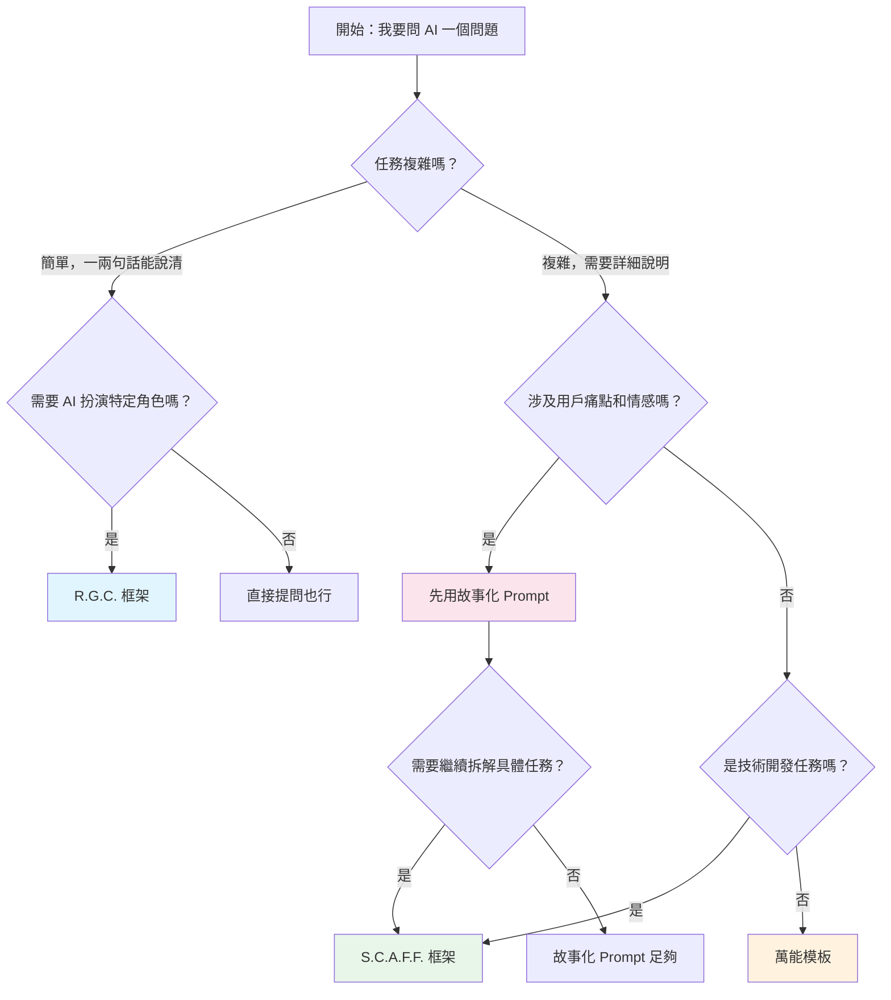

# 3.2.5 框架選擇指南

## 經過本節學習，你將掌握

- 根據任務類型快速選擇合適的框架
- 理解各框架之間的關係
- 獲得一個提問前的快速檢查清單
- 知道何時該從一個框架切換到另一個


## 框架速查表

| 場景 | 推薦框架 | 原因 |
|-----|---------|------|
| 需要表達用戶痛點和情感 | 故事化 Prompt（第二章） | 情感共鳴更強，AI 能理解"爲什麼" |
| 複雜的技術開發任務 | S.C.A.F.F. | 結構完整，約束清晰 |
| 快速簡單提問 | R.G.C. | 簡潔高效，減少輸入 |
| 不確定用哪個框架 | 萬能模板 | 覆蓋面廣，不容易出錯 |
| 代碼審查、重構 | R.G.C. | 代碼本身提供了上下文 |
| 需求描述、產品設計 | 故事化 + S.C.A.F.F. | 先講故事，再拆任務 |
| 數據分析、報告生成 | 萬能模板 | 任務類型多樣，通用性強 |
| 學習概念、尋求解釋 | R.G.C. | 簡單直接 |


## 決策流程圖



**簡化版決策**：

1. **任務簡單** → R.G.C.
2. **任務複雜 + 技術開發** → S.C.A.F.F.
3. **任務複雜 + 非技術** → 萬能模板
4. **需要表達用戶故事** → 故事化 Prompt
5. **不確定** → 萬能模板


## 框架關係圖

四種框架不是互相替代，而是互相補充：

```
┌─────────────────────────────────────────────────────────┐
│                     萬能模板                              │
│            （最通用，覆蓋面廣，什麼都能用）                   │
│  ┌─────────────────────┐  ┌─────────────────────┐      │
│  │    S.C.A.F.F.       │  │    故事化 Prompt     │      │
│  │  （技術開發專用）     │  │   （情感溝通專用）    │      │
│  │                     │  │                     │      │
│  │  ┌─────────────┐    │  │                     │      │
│  │  │   R.G.C.    │    │  │                     │      │
│  │  │ （快速簡化版）│    │  │                     │      │
│  │  └─────────────┘    │  │                     │      │
│  └─────────────────────┘  └─────────────────────┘      │
└─────────────────────────────────────────────────────────┘
```

- **R.G.C.** 是 **S.C.A.F.F.** 的精簡版
- **S.C.A.F.F.** 和 **故事化 Prompt** 是並列關係，各有側重
- **萬能模板** 是最大的集合，什麼場景都能用


## 提問前檢查清單

在按下發送鍵之前，快速過一遍：

### 基礎檢查（必須）

- [ ] **任務是否清晰**：AI 能明白你要它做什麼嗎？
- [ ] **背景是否充足**：AI 有足夠信息做出正確判斷嗎？
- [ ] **約束是否明確**：AI 知道什麼不該做嗎？

### 進階檢查（推薦）

- [ ] **角色是否指定**：AI 應該以什麼身份回答？
- [ ] **格式是否說明**：你期望什麼形式的輸出？
- [ ] **示例是否需要**：給個例子會不會更清楚？

### 反思檢查（可選）

- [ ] **有沒有說太多**：是不是一次要求太多了？
- [ ] **有沒有說太少**：是不是遺漏了關鍵信息？
- [ ] **邊界是否清晰**：AI 會不會"加戲"？


## 框架切換信號

當你用某個框架提問後，AI 輸出不理想，這可能是框架選擇或填寫的問題：

| AI 輸出問題 | 可能原因 | 調整方向 |
|-----------|---------|---------|
| 技術方案和項目不匹配 | 缺少項目背景 | 補充 Situation |
| 功能範圍和預期不符 | 任務描述不清 | 重寫 Challenge/Goal |
| 代碼複雜度不合適 | 沒說明受衆水平 | 添加 Audience |
| 輸出格式混亂 | 沒指定格式 | 添加 Format |
| AI "加戲"太多 | 約束不夠 | 補充 Constraints/Foundations |
| 回答太技術化 | 角色設定問題 | 調整 Role |
| 沒有理解核心痛點 | 缺少故事背景 | 切換到故事化 Prompt |


## 實戰建議

### 給初學者

剛開始時，建議**嚴格按框架填寫**，哪怕感覺有些項目是"多餘的"。

原因：
1. 框架幫你檢查是否遺漏關鍵信息
2. 建立結構化思維的習慣
3. 當輸出不理想時，有框架可以對照排查

### 給有經驗的用戶

熟練後，可以根據任務**靈活簡化**：

- 簡單任務：R.G.C. 甚至直接提問
- 複雜任務：完整框架
- 重複任務：基於之前的提示詞微調

**核心原則**：框架是工具，不是規則。讓它幫你，而不是束縛你。


## 本章回顧

恭喜你完成了「結構化提示詞框架」的學習。現在你掌握了：

| 工具 | 用途 | 核心要素 |
|-----|------|---------|
| S.C.A.F.F. | 複雜技術任務 | 情境、挑戰、受衆、格式、基礎 |
| R.G.C. | 快速簡單提問 | 角色、目標、約束 |
| 萬能模板 | 通用場景 | 角色、背景、任務、要求、約束、格式、示例 |
| 故事化 Prompt | 表達用戶痛點 | 身份、現狀、痛點、期望 |


## 下一步預告

結構化框架解決了"怎麼組織信息"的問題。但有時候，光有結構還不夠——你需要一些**特殊技巧**讓 AI 的推理更深入、輸出更準確。

下一節「3.3 進階提示技巧」，我們將學習：

- **Zero-shot**：直接提問的藝術
- **Few-shot**：用示例教會 AI
- **Chain of Thought**：讓 AI "想一想"再回答
- **Tree of Thoughts**：探索多條推理路徑
- **Self-Critique**：讓 AI 自我檢查

這些技巧可以和結構化框架**組合使用**，進一步提升 AI 輸出的質量。

準備好了嗎？讓我們進入下一節。
