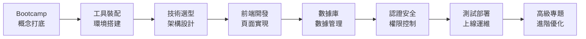

# 下部預告：Vibe Coding 全棧實戰教程

你已經學會了 Vibe Coding 的基礎心法。

但故事還沒有結束。

## 從"能做出來"到"做得專業"

基礎版教會你"從0到1"。

進階版將帶你"從1到100"。

**你將學到的不再只是"怎麼用 AI 寫代碼"，而是"怎麼用 AI 構建真實的產品"。**

## 進階版核心內容預覽

進階版包含 **Bootcamp（第0章）+ 12 個核心章節**，覆蓋全棧開發的完整生命週期：

### 各章節詳解

| 章節 | 主題 | 你將學到 |
|:----:|:-----|:---------|
| **0** | Bootcamp 概念打底 | 計算機基礎、命令行、前端三件套、開發環境配置、Docker 入門 |
| **1** | 概念與準備 | 工具裝配、Vibe Coding 心法進階、第一次部署、AI 協作工作流 |
| **2** | 技術選型與架構 | Next.js + TypeScript + Prisma 全景、渲染策略、分層架構 |
| **3** | 前端開發 | React 組件、狀態管理、路由系統、UI 組件庫實戰 |
| **4** | 數據庫與數據 | PostgreSQL、Prisma ORM、數據建模、CRUD 操作 |
| **5** | 產品與文檔 | PRD 進階、技術文檔、API 文檔自動生成 |
| **6** | 認證與安全 | 用戶認證、權限管理、安全最佳實踐 |
| **7** | API 設計規範 | RESTful 設計、數據校驗、錯誤處理 |
| **8** | 項目規則與協作 | Git 工作流、代碼規範、團隊協作 |
| **9** | 測試與質量 | 單元測試、集成測試、E2E 測試 |
| **10** | 部署與運維 | Vercel 部署、Docker 容器化、CI/CD 流水線 |
| **11** | 發佈與覆盤 | 版本管理、用戶反饋、迭代優化 |
| **12** | 高級專題 | SEO 優化、性能調優、AI SDK 集成、即時通信 |

## 核心技術棧

進階版將使用這套 **2025 年主流全棧技術棧**：

| 層級 | 技術選型 | 爲什麼選它 |
|:----:|:---------|:-----------|
| **框架** | Next.js 16+ (App Router) | 全棧能力、極致性能、AI 友好 |
| **語言** | TypeScript | 類型安全、減少 Bug、AI 生成代碼更可靠 |
| **數據庫** | PostgreSQL + Prisma | 類型安全 ORM、強大生態 |
| **樣式** | Tailwind CSS + shadcn/ui | 原子化 CSS、開箱即用組件 |
| **部署** | Vercel / Docker | 零配置部署 / 自主可控 |

::: tip 💡 爲什麼是這套技術棧？
這套技術棧有幾個特點：
1. **AI 擅長** —— 大模型對這些技術的理解最深，生成的代碼質量最高
2. **社區活躍** —— 遇到問題容易找到答案
3. **文檔完善** —— 學習曲線相對平緩
4. **工業級** —— 可以用於生產環境，不是"玩具"
:::

## 進階版適合誰？

進階版適合**已完成基礎版**，並且：

- [x] 能獨立用 AI 工具做出簡單項目
- [x] 理解 MVP、Prompt、用戶旅程等核心概念
- [x] 想做更復雜、更專業的產品
- [x] 有耐心學習更系統的技術知識
- [x] 願意投入更多時間深入學習

## 預計學習時長

| 學習目標 | 預計時長 | 適合人羣 |
|:--------|:---------|:---------|
| 快速過一遍 | 2-3 周 | 有編程基礎，想了解全棧流程 |
| 系統學習 | 4-6 周 | 想紮實掌握，邊學邊做項目 |
| 深入實踐 | 8-12 周 | 想做出可發佈的完整產品 |

::: info 📖 學習建議
進階版內容較多，不建議一口氣學完。

推薦的節奏是：
1. 每週學習 1-2 個章節
2. 每個章節都跟着動手實踐
3. 遇到問題先問 AI，再查文檔
4. 定期回顧，鞏固知識

**記住：做出來比學完更重要。**
:::

## 從基礎到進階的知識橋樑

下面這張表展示了基礎版和進階版的知識銜接：

| 領域 | 基礎版（已掌握） | 進階版（將深入） |
|:-----|:----------------|:----------------|
| **思維方法** | MVP、靈魂三問、用戶旅程 | PRD 進階、技術文檔、架構設計 |
| **工具使用** | Bolt.new / Claude / Cursor 基礎 | IDE 深度配置、AI 協作工作流優化 |
| **前端** | 簡單 HTML/CSS/JS | React、Next.js、組件化開發 |
| **數據存儲** | LocalStorage | PostgreSQL、Prisma、數據建模 |
| **部署** | Vercel 一鍵部署 | Docker 容器化、CI/CD 流水線 |
| **安全** | 基本安全意識 | 認證系統、權限管理、安全審計 |
| **質量保證** | AI 幫你 Debug | 自動化測試、代碼審查 |

## 準備好了嗎？

進階之路不會輕鬆。

但你已經證明了自己：

- 你學完了基礎版
- 你做出了自己的項目
- 你克服了"我不會編程"的心理障礙

**這些，都是最難的部分。**

接下來的路，只是把你已經掌握的能力，用到更大的舞臺上。

當你準備好了，歡迎進入[進階版教程](/Advanced/00-bootcamp/)。

**我們在那裏見。** 🚀
