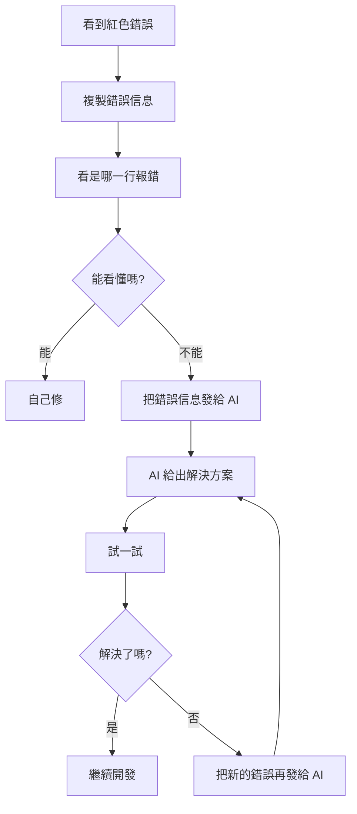

# B.1 JavaScript 錯誤

遇到錯誤別慌！這一節列出了最常見的 JavaScript 錯誤，以及對應的解決方法。遇到問題時，直接查表就行。


## undefined 錯誤

**錯誤信息**：
```
Uncaught TypeError: Cannot read properties of undefined (reading 'xxx')
```

**通俗解釋**：你在試圖使用一個「不存在」的東西。就像你問「小明的手機號」，但小明這個人不存在。

**常見原因**：
| 原因 | 示例代碼 | 修復方法 |
|------|----------|----------|
| 變量沒有賦值 | `let user; console.log(user.name)` | 先檢查變量是否有值 |
| 數組越界 | `arr[10]` 但數組只有 3 個元素 | 檢查數組長度 |
| 對象屬性拼寫錯誤 | `user.nmae`（應該是 `name`） | 檢查屬性名拼寫 |
| 函數沒有返回值 | `function get() {}` 然後用返回值 | 確保函數有 `return` |

**快速修復 Prompt**：
```markdown
我的代碼報錯：Cannot read properties of undefined (reading 'xxx')

錯誤出現在這行：[粘貼報錯的那行代碼]

請幫我分析原因並修復。
```


## null 錯誤

**錯誤信息**：
```
Uncaught TypeError: Cannot read properties of null (reading 'xxx')
```

**通俗解釋**：你在試圖使用一個「明確是空」的東西。就像一個空盒子，你卻想從裏面拿東西。

**常見原因**：
| 原因 | 示例代碼 | 修復方法 |
|------|----------|----------|
| DOM 元素沒找到 | `document.getElementById('btn')` 返回 null | 檢查 ID 是否正確，或元素是否存在 |
| API 返回 null | 後端返回了 `null` | 添加空值判斷 |
| LocalStorage 沒數據 | `JSON.parse(localStorage.getItem('data'))` | 添加默認值：`|| []` |

**快速修復 Prompt**：
```markdown
我的代碼報錯：Cannot read properties of null

我想獲取頁面上 ID 爲 [xxx] 的元素，但返回了 null。

請幫我檢查可能的原因。
```


## TypeError

**錯誤信息**：
```
Uncaught TypeError: xxx is not a function
```

**通俗解釋**：你把一個不是函數的東西當函數用了。就像你對着一塊石頭說「給我唱首歌」。

**常見原因**：
| 原因 | 示例代碼 | 修復方法 |
|------|----------|----------|
| 變量名覆蓋了函數名 | 定義了 `let alert = 'hi'`，然後 `alert('hello')` | 避免用內置函數名作變量名 |
| 方法名拼寫錯誤 | `arr.pushs(1)`（應該是 `push`） | 檢查方法名拼寫 |
| 調用了不存在的方法 | 對數字調用字符串方法 | 檢查數據類型 |


## ReferenceError

**錯誤信息**：
```
Uncaught ReferenceError: xxx is not defined
```

**通俗解釋**：你用了一個根本沒有定義過的變量。就像你說「請把 xxx 遞給我」，但屋子裏根本沒有這個東西。

**常見原因**：
| 原因 | 示例代碼 | 修復方法 |
|------|----------|----------|
| 變量名拼寫錯誤 | `consle.log`（應該是 `console`） | 檢查拼寫 |
| 變量作用域問題 | 在函數外訪問函數內的變量 | 理解作用域，或把變量定義在外面 |
| 忘記引入庫 | 使用了 jQuery 但沒引入 | 確保依賴已加載 |


## SyntaxError

**錯誤信息**：
```
Uncaught SyntaxError: Unexpected token 'xxx'
```

**通俗解釋**：代碼的「語法」寫錯了。就像中文裏少了標點符號，句子讀不通。

**常見原因**：
| 原因 | 示例代碼 | 修復方法 |
|------|----------|----------|
| 少了括號 | `if (x > 1 {` | 補上缺少的括號 |
| 多了逗號 | `[1, 2, 3,]`（某些情況） | 刪掉多餘的逗號 |
| 引號不匹配 | `'hello"` | 使用配對的引號 |
| JSON 格式錯誤 | `{name: 'test'}` 應該是 `{"name": "test"}` | JSON 的 key 必須用雙引號 |

::: tip 語法錯誤的特點
語法錯誤通常在代碼運行前就會報錯，而且瀏覽器會告訴你在哪一行。仔細看那一行和它的上一行，問題通常就在那附近。
:::


## 錯誤排查通用流程



記住：**報錯不可怕，複製粘貼給 AI 就行**。
