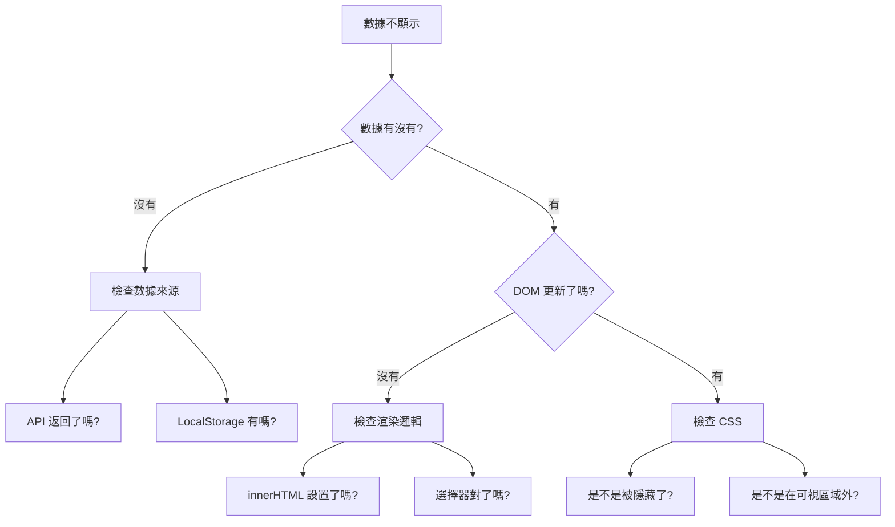

# B.3 交互問題

頁面能顯示，但點擊、輸入等交互沒反應？這一節幫你解決最常見的交互問題。


## 按鈕無反應

**現象**：點擊按鈕後，什麼都沒發生。

**排查清單**：

| 檢查項 | 怎麼檢查 | 解決方法 |
|--------|----------|----------|
| 事件沒綁定 | 檢查 HTML 中的 `onclick` 或 JS 中的 `addEventListener` | 確保事件處理函數正確綁定 |
| 函數名寫錯 | 檢查 `onclick="xxx()"` 中的函數名 | 確保和 JS 中定義的函數名一致 |
| JS 文件沒加載 | 看控制檯有沒有 404 錯誤 | 檢查 `<script>` 標籤路徑 |
| JS 有語法錯誤 | 看控制檯有沒有紅色錯誤 | 修復語法錯誤後，後面的代碼纔會執行 |
| 被其他元素遮擋 | 檢查按鈕上方有沒有透明元素 | 調整 `z-index` 或移除遮擋元素 |

**快速修復 Prompt**：
```markdown
我的按鈕點擊沒反應。

HTML 按鈕代碼：
[粘貼按鈕代碼]

JS 函數代碼：
[粘貼對應的 JS 代碼]

控制檯錯誤信息（如果有）：
[粘貼錯誤信息]

請幫我排查原因。
```


## 表單提交失敗

**現象**：填完表單點提交，頁面刷新了但數據沒處理。

**常見原因與解決**：

### 頁面刷新問題
```javascript
// 問題：表單提交後頁面刷新了
// 解決：阻止默認行爲
form.addEventListener('submit', function(e) {
  e.preventDefault();  // 阻止默認的表單提交
  // 然後在這裏處理數據
});
```

### 獲取不到輸入值
```javascript
// 問題：獲取的值是空的
// 檢查 1：選擇器是否正確
const input = document.getElementById('username');  // ID 要對應

// 檢查 2：獲取值的方式
const value = input.value;  // 注意是 .value 不是 .innerText

// 檢查 3：獲取時機是否正確（要在用戶輸入後獲取）
```

### 數據格式問題
```javascript
// 問題：數字被當成字符串
const age = document.getElementById('age').value;  // "25"（字符串）
const ageNumber = parseInt(age);  // 25（數字）

// 或者用 Number()
const ageNumber2 = Number(age);
```


## 數據不顯示

**現象**：數據存了，但頁面上看不到。

**排查步驟**：



**常見修復代碼**：

```javascript
// 檢查數據是否存在
const data = localStorage.getItem('quotes');
console.log('存儲的數據:', data);  // 用 console.log 檢查

// 確保解析正確
const quotes = JSON.parse(data) || [];
console.log('解析後的數組:', quotes);

// 確保渲染到正確位置
const container = document.getElementById('list');
if (container) {
  container.innerHTML = quotes.map(q => `<p>${q}</p>`).join('');
} else {
  console.log('找不到容器元素！');
}
```


## 數據存了但刷新後沒了

**現象**：數據操作成功了，但刷新頁面後數據消失。

**排查清單**：

| 可能原因 | 檢查方法 | 解決方法 |
|----------|----------|----------|
| 沒有持久化存儲 | 檢查有沒有用 LocalStorage | 數據變化時保存到 LocalStorage |
| 存儲時機不對 | 檢查保存代碼是否執行 | 在數據變化後立即保存 |
| 加載時機不對 | 檢查頁面加載時是否讀取數據 | 在頁面加載時從 LocalStorage 讀取 |
| 存儲格式問題 | 檢查存儲的數據格式 | 用 JSON.stringify 存，JSON.parse 取 |

**完整的存取示例**：
```javascript
// 保存數據
function saveQuotes(quotes) {
  localStorage.setItem('quotes', JSON.stringify(quotes));
}

// 讀取數據
function loadQuotes() {
  const data = localStorage.getItem('quotes');
  return data ? JSON.parse(data) : [];
}

// 頁面加載時讀取
document.addEventListener('DOMContentLoaded', function() {
  const quotes = loadQuotes();
  renderQuotes(quotes);
});

// 添加新數據時保存
function addQuote(newQuote) {
  const quotes = loadQuotes();
  quotes.push(newQuote);
  saveQuotes(quotes);  // 別忘了保存！
  renderQuotes(quotes);
}
```


## 交互問題通用排查口訣

> **看控制檯** → **加 console.log** → **檢查時機** → **問 AI**

1. **看控制檯**：有紅色錯誤嗎？
2. **加 console.log**：代碼執行到哪一步了？數據是什麼？
3. **檢查時機**：代碼是在正確的時間執行嗎？
4. **問 AI**：把相關代碼和現象描述清楚
