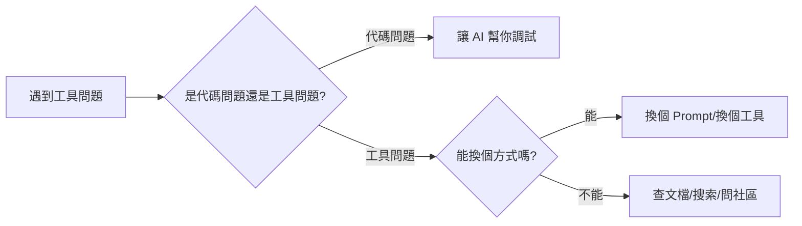

# B.4 工具問題

這一節解決你在使用 AI 編程工具時可能遇到的問題。


## AI 不理解我的需求

**現象**：AI 給的代碼完全不是你想要的。

**可能原因與解決**：

| 原因 | 解決方法 |
|------|----------|
| 描述太模糊 | 增加具體細節，比如尺寸、顏色、位置 |
| 需求太複雜 | 拆分成多個小需求，一步一步來 |
| 缺少上下文 | 告訴 AI 你已有的代碼結構、用的技術棧 |
| 術語不準確 | 換個說法，或者用截圖/示例網站描述 |

**示例對比**：

```markdown
❌ 不好的描述：
做一個好看的頁面

✅ 好的描述：
做一個產品展示頁面。
- 頂部是大標題"智能記賬本"，白色字，藍色背景
- 下面是 3 個功能介紹卡片，橫向排列
- 每個卡片有圖標、標題、一句話描述
- 底部有一個"立即下載"按鈕
- 整體風格簡潔現代
```


## AI 生成的代碼無法運行

**現象**：複製 AI 的代碼後，頁面報錯或空白。

**排查清單**：

| 檢查項 | 解決方法 |
|--------|----------|
| 代碼不完整 | 讓 AI 「請給出完整代碼」 |
| 缺少依賴 | 詢問需要引入什麼庫或框架 |
| 代碼需要在特定環境運行 | 確認是瀏覽器代碼還是 Node.js 代碼 |
| 文件結構不對 | 讓 AI 說明代碼應該放在哪個文件 |
| 複製粘貼出錯 | 檢查是否漏複製了什麼 |

**快速修復 Prompt**：
```markdown
你給的代碼運行後出錯了。

錯誤信息：
[粘貼錯誤信息]

請幫我修復，並給出完整的可運行代碼。
```


## 部署失敗

**現象**：本地能跑，但部署到 Vercel/Netlify 後打不開。

**常見原因與解決**：

| 錯誤類型 | 可能原因 | 解決方法 |
|----------|----------|----------|
| Build failed | 代碼有語法錯誤 | 查看部署日誌，修復錯誤 |
| 404 Not Found | 文件路徑問題 | 檢查文件名大小寫、路徑是否正確 |
| 頁面空白 | JS 報錯 | 打開瀏覽器控制檯查看錯誤 |
| 樣式丟失 | CSS 路徑問題 | 使用相對路徑，確保文件已上傳 |
| API 不工作 | 環境變量沒配置 | 在部署平臺配置環境變量 |

**部署前檢查清單**：
- [ ] 所有文件都已保存
- [ ] 本地測試運行正常
- [ ] 文件名沒有使用中文和特殊字符
- [ ] 路徑使用相對路徑（`./` 或 `../`）
- [ ] 入口文件是 `index.html`


## AI 反覆給同樣的錯誤答案

**現象**：反覆問 AI，它一直給同樣的（錯誤的）代碼。

**解決策略**：

### 策略 1：換個問法
```markdown
之前：請幫我實現一個輪播圖

之後：請用原生 JavaScript 實現一個圖片輪播組件，要求：
- 每 3 秒自動切換到下一張
- 底部有小圓點指示當前圖片
- 點擊圓點可以跳轉到對應圖片
```

### 策略 2：明確排除
```markdown
請幫我實現 xxx，但是不要使用 [之前失敗的方案]。
```

### 策略 3：提供更多信息
```markdown
我按你說的做了，但還是報錯。具體情況：
- 我的代碼：[粘貼]
- 報錯信息：[粘貼]
- 我的操作步驟：[描述]
```

### 策略 4：換一個 AI 工具
不同的 AI 工具可能有不同的「知識盲區」。如果一個工具反覆不行，換一個試試。


## 網絡/登錄問題

| 問題 | 解決方法 |
|------|----------|
| 頁面加載慢 | 檢查網絡，嘗試科學上網 |
| 登錄不上 | 清除瀏覽器緩存，重新登錄 |
| 聊天沒響應 | 刷新頁面，或稍等幾分鐘 |
| 消息發不出去 | 檢查是否超出使用限制 |


## 工具問題通用解決思路



記住：**工具是爲你服務的，不是爲難你的。** 換個姿勢再試試！
