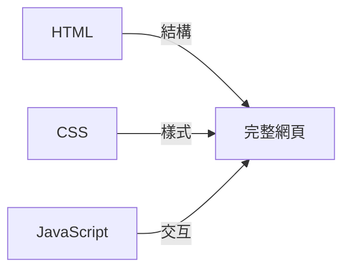

# C.3 技術相關

這些是做網頁/應用時會遇到的技術術語。


## HTML

**全稱**：HyperText Markup Language（超文本標記語言）

**一句話解釋**：定義網頁「有什麼內容」。

**類比**：就像房子的結構——哪裏是客廳、哪裏是臥室、哪裏是廚房。

**長什麼樣**：
```html
<h1>這是標題</h1>
<p>這是一段文字</p>
<button>這是按鈕</button>
```


## CSS

**全稱**：Cascading Style Sheets（層疊樣式表）

**一句話解釋**：定義網頁「長什麼樣」。

**類比**：就像房子的裝修——牆壁什麼顏色、沙發多大、燈放在哪。

**長什麼樣**：
```css
h1 {
  color: blue;      /* 字體顏色 */
  font-size: 24px;  /* 字體大小 */
}
```


## JavaScript

**簡稱**：JS

**一句話解釋**：讓網頁「能動」，有交互。

**類比**：就像房子裏的電器和開關——點開關燈會亮，按按鈕電視會開。

**長什麼樣**：
```javascript
// 點擊按鈕後彈出提示
button.onclick = function() {
  alert('你點擊了按鈕！');
}
```


## HTML + CSS + JS 的關係



| 技術 | 負責 | 類比 |
|------|------|------|
| HTML | 內容結構 | 房子的框架 |
| CSS | 外觀樣式 | 房子的裝修 |
| JavaScript | 行爲交互 | 房子的電器 |


## LocalStorage

**一句話解釋**：瀏覽器提供的本地存儲空間，數據保存在用戶電腦上。

**類比**：就像你房間裏的抽屜，東西放進去，關了門下次開門還在。

**特點**：
- 只存在用戶自己的瀏覽器裏
- 刷新頁面、關閉瀏覽器數據都還在
- 換個瀏覽器或電腦數據就沒了
- 適合存簡單的用戶偏好、記錄等

**使用示例**：
```javascript
// 存數據
localStorage.setItem('name', '小明');

// 取數據
const name = localStorage.getItem('name');  // '小明'

// 刪數據
localStorage.removeItem('name');
```


## JSON

**全稱**：JavaScript Object Notation

**一句話解釋**：一種數據格式，用來存儲和傳輸數據。

**類比**：就像一種通用的「表格格式」，大家都能看懂。

**長什麼樣**：
```json
{
  "name": "小明",
  "age": 25,
  "hobbies": ["讀書", "跑步", "編程"]
}
```

**常見用途**：
- API 返回的數據
- 配置文件
- LocalStorage 存儲複雜數據


## 環境變量

**一句話解釋**：存放敏感信息（如密鑰、密碼）的地方，不會被寫進代碼裏。

**類比**：就像保險箱。密碼放在保險箱裏，而不是貼在門上。

**爲什麼重要**：
- 密鑰寫在代碼裏，一旦代碼公開，密鑰就泄露了
- 環境變量不會被上傳到 GitHub
- 是安全的最佳實踐

**通常的用法**：
1. 創建 `.env` 文件存放敏感信息
2. 代碼中通過 `process.env.XXX` 讀取
3. `.env` 文件加入 `.gitignore`，不上傳


## 域名

**一句話解釋**：網站的地址，讓人能找到你的網站。

**類比**：就像你家的門牌號。有了地址，別人才能找到你家。

**結構**：
```
https://www.example.com/about
  │       │      │      │
協議    子域名  主域名  路徑
```

**獲取域名**：
- 去域名註冊商（如阿里雲、騰訊雲）購買
- 連接到你的部署平臺


## 響應式設計

**一句話解釋**：讓網頁在不同尺寸的屏幕上都能正常顯示。

**類比**：就像水，能適應不同形狀的容器。

**實現方式**：
- 使用百分比而不是固定像素
- 使用媒體查詢針對不同屏幕寫樣式
- 使用 Flexbox/Grid 佈局

**爲什麼重要**：
現在人們用手機、平板、電腦訪問網站，響應式設計讓所有用戶都有好的體驗。
