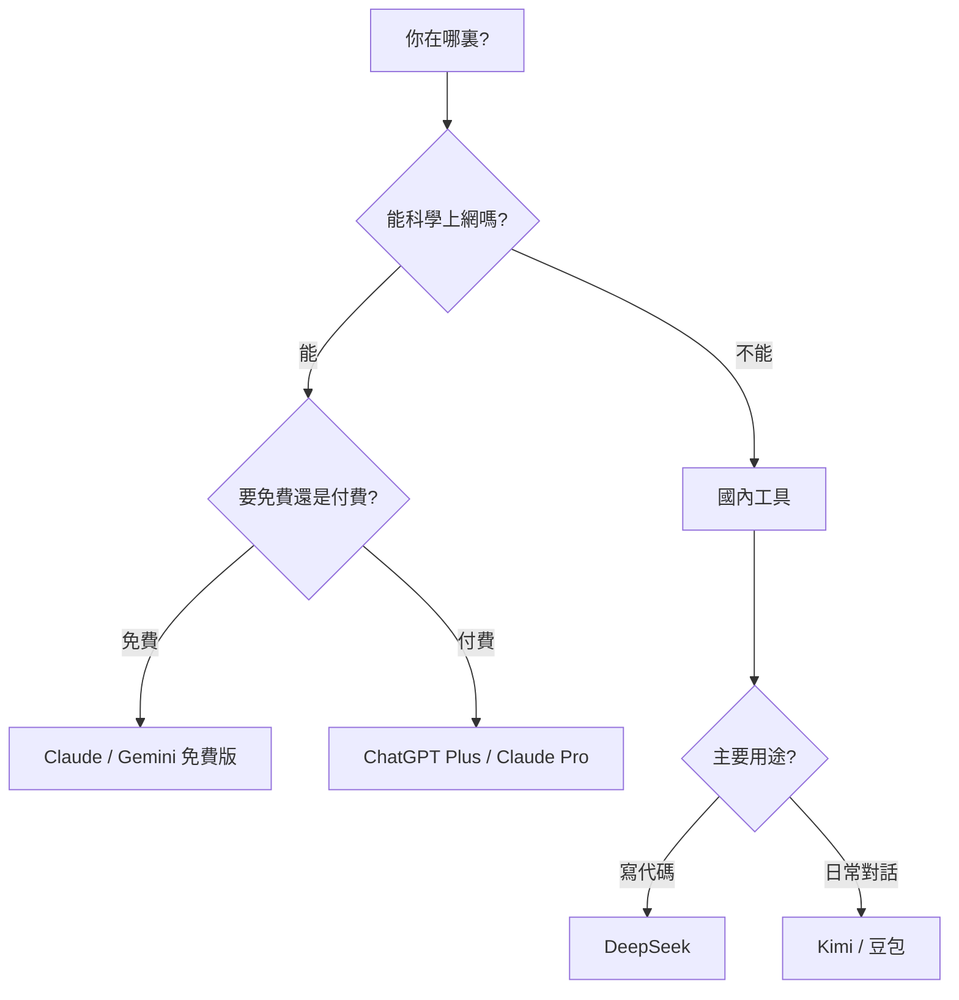

# D.1 對話式 AI 對比

對話式 AI 是最簡單的 AI 編程方式：直接對話，讓 AI 幫你寫代碼。以下是主流工具的對比。

## 綜合對比表

| 工具 | 公司 | 中文支持 | 免費額度 | 代碼能力 | 適合人羣 |
|------|------|----------|----------|----------|----------|
| **ChatGPT** | OpenAI | 良好 | 有限制 | 優秀 | 通用場景 |
| **Claude** | Anthropic | 優秀 | 有限制 | 優秀 | 長文本/複雜任務 |
| **Gemini** | Google | 良好 | 較多 | 良好 | Google 生態用戶 |
| **Kimi** | 月之暗面 | 原生 | 較多 | 良好 | 國內用戶 |
| **DeepSeek** | DeepSeek | 原生 | 免費 | 優秀 | 性價比首選 |
| **豆包** | 字節跳動 | 原生 | 免費 | 良好 | 國內新手 |

## 各工具詳解

### ChatGPT

**官網**：chat.openai.com

**特點**：
- AI 對話的「開山鼻祖」，生態最豐富
- GPT-4 代碼能力非常強
- 插件和 GPTs 擴展功能多

**限制**：
- 需要科學上網
- 免費版功能受限

**適合**：想體驗最成熟 AI 能力的用戶

### Claude

**官網**：claude.ai

**特點**：
- 超長上下文窗口（可處理很長的代碼）
- 推理能力強，適合複雜任務
- 中文理解能力優秀
- 更不容易產生幻覺

**限制**：
- 需要科學上網
- 免費版有對話次數限制

**適合**：處理長代碼、複雜邏輯的用戶

### Gemini

**官網**：gemini.google.com

**特點**：
- Google 出品，與 Google 服務整合好
- 多模態能力強（可以理解圖片）
- 免費額度較多

**限制**：
- 需要科學上網
- 代碼能力略遜於 GPT-4 和 Claude

**適合**：使用 Google 生態的用戶

### Kimi

**官網**：kimi.moonshot.cn

**特點**：
- 國內可直接訪問
- 超長上下文支持
- 中文理解優秀
- 可以讀取文件和網頁

**限制**：
- 代碼能力相對弱一些
- 有使用次數限制

**適合**：國內用戶的入門首選

### DeepSeek

**官網**：chat.deepseek.com

**特點**：
- 國內可直接訪問
- 代碼能力非常強（DeepSeek Coder）
- 完全免費使用
- 性價比極高

**限制**：
- 知名度相對較低
- 生態不如 ChatGPT 豐富

**適合**：想要高質量免費工具的用戶，強烈推薦

### 豆包

**官網**：www.doubao.com

**特點**：
- 字節跳動出品
- 國內可直接訪問
- 界面友好，上手簡單
- 免費使用

**限制**：
- 代碼能力一般
- 更適合日常對話

**適合**：國內完全零基礎的新手

## 選擇建議

## 快速推薦

| 你的情況 | 推薦工具 |
|----------|----------|
| 國內用戶，想寫代碼 | DeepSeek |
| 國內用戶，入門體驗 | Kimi |
| 能科學上網，追求最強 | Claude / ChatGPT |
| 能科學上網，想免費用 | Gemini |

::: tip 建議
不用糾結選哪個，**先用起來**最重要。等你熟悉了，再根據需要切換工具。
:::
