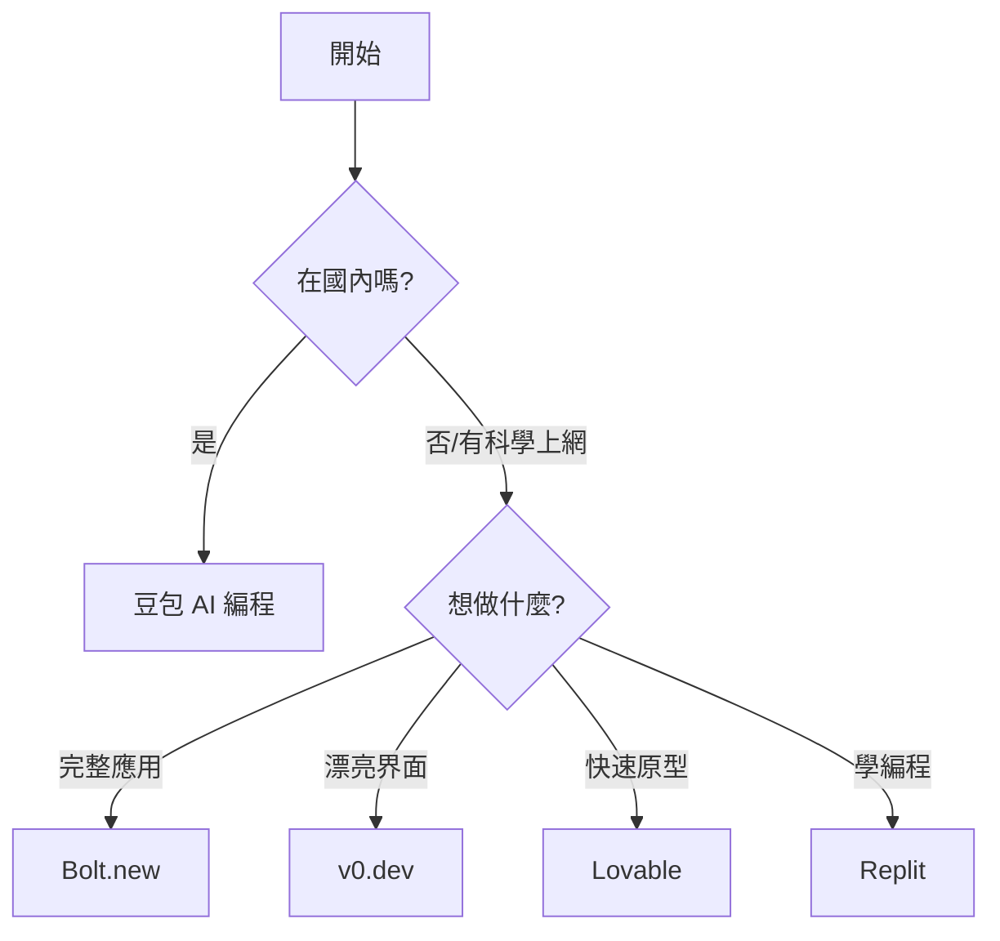

# D.3 專用 AI IDE 對比

專用 AI IDE 是爲「不懂代碼的人」設計的。在網頁上描述你想要什麼，AI 直接給你做出來。這是零基礎最友好的方式。

## 綜合對比表

| 工具 | 特點 | 價格 | 優勢 | 適合 |
|------|------|------|------|------|
| **Bolt.new** | 全棧應用生成 | 免費版可用 | 功能最全面 | 想做完整應用 |
| **豆包 AI 編程** | 代碼生成+預覽 | 免費 | 國內訪問流暢 | 國內用戶首選 |
| **v0.dev** | UI 組件生成 | 免費版可用 | UI 設計感強 | 想做漂亮界面 |
| **Lovable** | 產品原型 | 免費版可用 | 上手簡單 | 快速驗證想法 |
| **Replit Agent** | 在線 IDE + AI | 免費版可用 | 一站式體驗 | 想學編程的新手 |

## 各工具詳解

### Bolt.new

**官網**：bolt.new

**是什麼**：StackBlitz 推出的 AI 全棧開發平臺，可以用自然語言做出完整應用。

**核心功能**：
- 描述需求，生成完整項目
- 支持前端 + 後端 + 數據庫
- 即時預覽效果
- 一鍵部署

**價格**：
- 免費版：有使用限制
- 付費版：$20/月起

**優點**：
- 能做的東西最複雜
- 生成的代碼質量高
- 可以繼續迭代修改

**缺點**：
- 免費額度較少
- 國內訪問較慢，需要科學上網
- 複雜需求有時需要多輪調整

**適合**：想做完整應用的用戶（海外或有科學上網條件的用戶）

### 豆包 AI 編程

**官網**：[doubao.com/chat/coding](https://www.doubao.com/chat/coding)

**是什麼**：字節跳動推出的 AI 編程助手，支持代碼生成和即時預覽，是國內用戶的理想選擇。

**核心功能**：
- 自然語言描述需求，生成代碼
- HTML/CSS/JavaScript 即時預覽
- 代碼解釋、修復和優化
- 支持上傳代碼文件或引入 GitHub 項目

**價格**：
- 免費使用

**優點**：
- 國內訪問流暢，無需科學上網
- 界面簡潔，上手容易
- 支持中文交互，理解更準確
- 免費無限制

**缺點**：
- 功能相比 Bolt.new 略簡單
- 部署功能不如 Bolt.new 完善

**適合**：國內用戶、想快速體驗 AI 編程的初學者

### v0.dev

**官網**：v0.dev

**是什麼**：Vercel 推出的 AI UI 生成工具，專注於做漂亮的界面。

**核心功能**：
- 描述需求，生成 UI 組件
- 基於 React + Tailwind CSS
- 可以直接複製代碼
- 支持迭代修改

**價格**：
- 免費版：每月有限次數
- Pro：$20/月

**優點**：
- UI 設計感非常好
- 生成的組件可以直接用
- 和 Vercel 部署無縫對接

**缺點**：
- 只能做 UI，不能做後端邏輯
- 需要了解 React 才能充分利用

**適合**：想快速做出漂亮界面的用戶

### Lovable

**官網**：lovable.dev

**是什麼**：專注於幫你快速做出產品原型的 AI 工具。

**核心功能**：
- 自然語言生成應用
- 簡潔直觀的界面
- 支持即時預覽
- 可以部署分享

**價格**：
- 免費版可用
- 付費版功能更多

**優點**：
- 上手最簡單
- 非常適合驗證想法
- 界面友好

**缺點**：
- 功能相對簡單
- 複雜應用可能力不從心

**適合**：想快速驗證想法的用戶

### Replit Agent

**官網**：replit.com

**是什麼**：Replit 是在線 IDE，Agent 是其 AI 助手，可以幫你從零做出應用。

**核心功能**：
- 在線編寫和運行代碼
- AI 幫你生成代碼
- 支持多種編程語言
- 可以直接部署

**價格**：
- 免費版：基礎功能
- Replit Core：$20/月

**優點**：
- 一站式體驗（寫代碼 + 運行 + 部署）
- 學習編程的好地方
- 社區活躍，有很多模板

**缺點**：
- AI 能力不如專門的 AI 工具
- 免費版有資源限制

**適合**：想在學習編程的同時使用 AI 的用戶

## 選擇建議

| 情況 | 推薦工具 |
|----------|----------|
| 國內用戶，想快速上手 | 豆包 AI 編程 |
| 做一個完整的小應用 | Bolt.new |
| 做漂亮的網頁界面 | v0.dev |
| 快速驗證一個想法 | Lovable |
| 邊學編程邊做東西 | Replit |

## 本教程推薦

**國內用戶推薦從豆包 AI 編程開始**，訪問流暢、免費、支持即時預覽。

**海外或有科學上網條件的用戶推薦 Bolt.new**，功能最全面。

選擇理由：
1. 功能全面，能做出「有用」的東西
2. 不需要任何編程知識
3. 界面直觀，上手簡單
4. 生成的代碼質量不錯，以後想學代碼也有參考

::: tip 記住
工具只是工具。重要的是你想做什麼、解決什麼問題。選一個順手的，先用起來！
:::
